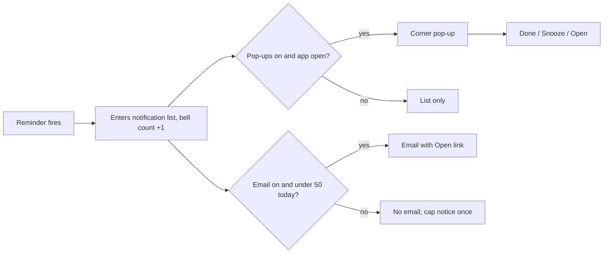

# Design — Reminders and Notifications

> **Approved** by @user on 2026-09-23. Locked — changes require a change record (§7).

Context: [PRD](./01-prd.md)
Canvas: https://claude.ai/artifact/3FqQWwFBqv9wN1Q214wvNB
Exports: `./assets/canvas/`

Over the 200-line budget at about 255: every state of every surface is listed
with its artboard, per the design rule, and those tables are most of the length.

## 1. Design intent

Reminders should feel like records that talk back, not a second app. Every
surface reuses 001's warm-paper tokens, table, card and pill shapes unchanged.
The new ideas are few: a bell with a count on every screen, a slide-over
notification panel, a corner pop-up that stays until dealt with, and a
Reminders tab grouped so "what did I miss" is the first thing read.

Four layout choices were settled by the user before drawing, 2026-09-23:

| Choice | Picked | Lost |
|---|---|---|
| Where the notification list lives | A bell on the topbar opening a slide-over panel | A fourth sidebar page; both |
| Pop-up behaviour | Bottom-right card, stays until acted on or closed, stacks | Auto-hide after 10 seconds; a top banner |
| Reminders in Records | Grouped: Needs attention, Upcoming, Done | One flat table like Tasks; a day timeline |
| Email | Plain, lightly branded, one button | A rich styled card; plain text only |

## 2. Screen inventory

| Screen | Purpose | Serves | Canvas artboard |
|---|---|---|---|
| Reminder set | `/remind` confirmation card echoing when and repeat | FR-1, FR-5, FR-6 | `RemindCapture` |
| Resolved times | Default time, passed time, month-end rule, each explained under the value | FR-3, FR-4, FR-8 | `RemindResolved` |
| Question and cap | No date asks one question; the 101st reminder is refused, input kept | FR-2, FR-38 | `RemindAsk` |
| `/reminders` | Active reminders in Capture, soonest first | FR-25 | `RemindList` |
| Records, Reminders tab | Grouped list with Done and Snooze inline on rows needing attention | FR-19 to FR-24, FR-26 | `Main` |
| Records, All tab | Reminders mixed with tasks; round marker for reminders | FR-26 | `RecordsAll` |
| Reminder detail | Next fire, repeat, timezone, last fired and its outcome, origin | FR-27 | `ReminderDetail` |
| Edit reminder | Text, start date, time, repeat with interval and weekdays | FR-6, FR-7, FR-28 | `ReminderEdit` |
| Delete reminder | Confirmation naming that the whole series goes | FR-29, FR-30 | `DeleteReminder` |
| Notification panel | Newest first, unread dots, Late and Missed markers, mark all read, email-cap notice | FR-12, FR-17, FR-18, FR-35 to FR-37, FR-39, FR-40 | `NotificationPanel` |
| Pop-up | Bottom-right card with Done, Snooze menu and Open; stacks | FR-13, FR-21, FR-22 | `ReminderToast` |
| Settings, Reminders | Default time, pop-up switch, email switch, note that the list always records | FR-31 to FR-33 | `SettingsReminders` |
| Settings, both off | The one-time warning | FR-34 | `SettingsBothOff` |
| Email | On-time and late variants | FR-14, FR-15, FR-17 | `ReminderEmail` |
| Mobile | Notifications full screen, Reminders tab, pop-up above the tab bar | as desktop | `MobileNotifications`, `MobileRecordsReminders`, `MobileReminderToast` |
| States and errors | Every empty, error, offline, not-found, invalid-input and failed-save state | FR-2, FR-26 to FR-29, FR-32, FR-38 | page 8: 16 artboards, named in §4 |
| Loading and feedback | Skeletons for Records, detail and Settings; spinners inside Save, Delete, pop-up Done and a Settings switch; success toasts on create and on edit | FR-1, FR-19, FR-28, FR-29, FR-31, FR-32 | page 7: `RecordsLoading`, `ReminderDetailLoading`, `SettingsLoading`, `ReminderEditSaving`, `DeleteReminderBusy`, `PopupActing`, `SettingsSaving`, `ReminderEditSaved`, `RemindCreatedToast`, `MobileReminderSaved` |

### Dark theme

`DarkRecordsReminders`, `DarkNotificationPanel`, `DarkReminderToast`,
`DarkSettingsReminders` and `DarkEditSaved` use 001's dark tokens exactly, from
`001-capture-and-records-foundation/assets/canvas/DarkRecords.dc.html`. No new
palette.

## 3. Flows

| Flow | Entry | Steps | Exit | Serves |
|---|---|---|---|---|
| Set a reminder | Capture | Type `/remind …`, read the echoed when and repeat | Reminder set, or one question if no date | FR-1 to FR-8 |
| Reminder fires, app open | Anywhere | Bell count rises, pop-up appears, user picks Done, Snooze or Open | Closed, snoozed, or on its detail | FR-12, FR-13, FR-19 to FR-22 |
| Reminder fires, app closed | Email | Email arrives, "Open in Slashit", sign in if needed | Reminder detail | FR-14, FR-15 |
| Catch up | Bell | Panel opens, unread first read, act inline or mark all read | Panel closed | FR-35 to FR-37 |
| Manage | Records, Reminders | Open a row, edit or delete with confirmation | Updated list | FR-26 to FR-30 |
| Tune delivery | Settings | Change default time or switches; warning if both off | Saved | FR-31 to FR-34 |

## 4. States

Every state below has its own artboard, per the design rule added to
`process-docs/CLAUDE.md` on 2026-09-23. "No permission" means a session that
has ended: 001's in-place "Your session ended" card, drawn as
`RemindersSessionEnded`. A reminder id owned by another user renders the same
not-found as a deleted one (NFR-6), so ownership is never revealed. Every
failure says what did not change and keeps what the user typed.

### Records, Reminders tab
| State | What the user sees | Artboard |
|---|---|---|
| Empty | "No reminders yet", with the `/remind` example | `RemindersEmpty` |
| Loading | Skeleton rows under the real headers. Never a full-page spinner | `RecordsLoading` |
| Error | "Couldn't load your reminders. They are safe, and they still fire on time." Try again | `RemindersError` |
| Success | Grouped table | `Main` |
| No permission | "Your session ended", Sign in | `RemindersSessionEnded` |
| No search match | "No reminders match "dentist"", Clear search | `RemindersNoMatch` |
| Offline | Amber bar: reminders still fire and email still arrives; Done, Snooze and edits disabled; last-synced time in the footer | `RemindersOffline` |

### Notification panel
| State | What the user sees | Artboard |
|---|---|---|
| Empty | "Nothing here yet. When a reminder fires, it lands here." | `NotificationStates` |
| Loading | Four skeleton items | `NotificationStates` |
| Error | "Couldn't load notifications. Your reminders still fire." Try again | `NotificationStates` |
| Success | List with unread, Late, Missed and the email-cap notice | `NotificationPanel` |
| No permission | Never open when signed out; the page shows the session card | `RemindersSessionEnded` |
| Action failed | Inline under the item: "Couldn't mark it done. Try again." | `PanelActionFailed` |

### Pop-up
| State | What the user sees | Artboard |
|---|---|---|
| Empty | Nothing rendered | none needed |
| Loading | A spinner replaces the pressed button's label; the others dim and lock | `PopupActing` |
| Error | Card stays: "That didn't save. The reminder is still open. Try again." | `PopupFailed` |
| Success | Card leaves; the panel item updates | `ReminderToast` |
| No permission | Never shown signed out | none needed |
| Offline | Done and Snooze disabled, Open still works: "You're offline. Done and Snooze need a connection." | `PopupOffline` |

### Reminder detail, edit and delete
| State | What the user sees | Artboard |
|---|---|---|
| Not found | "This reminder doesn't exist or was deleted." Back to reminders | `ReminderNotFound` |
| Loading | Skeleton title, pills and field grid | `ReminderDetailLoading` |
| Saving | A spinner replaces the Save label; fields and Cancel lock | `ReminderEditSaving` |
| Invalid input | Field errors: "Give the reminder a name.", "Pick at least one day."; Save disabled | `ReminderEditInvalid` |
| Time already passed | On a one-time reminder: "That time has already passed. Pick a later time." | `ReminderEditPast` |
| Save failed | "Couldn't save your changes. Your edits are still here." Save becomes Try again | `ReminderEditFailed` |
| Deleted while editing | "This reminder was deleted from another tab or device." Save disabled | `ReminderEditGone` |
| Success | Detail with the success toast | `ReminderEditSaved` |
| Deleting | A spinner replaces the confirm label | `DeleteReminderBusy` |
| Delete failed | Inside the dialog: "Couldn't delete it. The reminder is unchanged." Try again | `DeleteReminderFailed` |
| No permission | Session card, or not-found for another user's id | `RemindersSessionEnded`, `ReminderNotFound` |

### Settings, Reminders
| State | What the user sees | Artboard |
|---|---|---|
| Empty | Defaults: 9:00 AM, both switches on | `SettingsReminders` |
| Loading | Page: skeleton rows. A change: small spinner beside the control | `SettingsLoading`, `SettingsSaving` |
| Error | The switch flips back: "Couldn't turn email off. It is still on. Try again." | `SettingsFailed` |
| Success | Value persists after reload | `SettingsReminders` |
| No permission | Session card | `RemindersSessionEnded` |

### Capture, `/remind`
| State | What the user sees | Artboard |
|---|---|---|
| Success | Confirmation card and the success toast | `RemindCapture`, `RemindCreatedToast` |
| No date | One question, nothing saved until answered | `RemindAsk` |
| Cap reached | Refusal, input kept | `RemindAsk` |
| Model unavailable | "Slashit can't read that right now. Nothing was saved." Input kept, Try again | `RemindModelDown` |
| Loading, offline | 001's capture loading and "Capture needs a connection", unchanged | 001's `CaptureLoading`, `PWAOffline` |

### Success toast
One shared behaviour, added 2026-09-23 at the user's request.

| Rule | Value |
|---|---|
| Shown on | Reminder created, reminder updated |
| Position | Top-centre, 16 px under the header, on every screen and on mobile |
| Lifetime | Hides after 4 seconds, or on its close button. Hover or focus pauses the timer |
| Content | Green check, one line of text, a View link |
| Stacking | A new toast replaces the current one |

> Assumption: top-centre and 4 seconds are Claude's defaults. The bottom-right corner belongs to reminder pop-ups, and the bottom of Capture to the command bar, so a toast there would cover one of them.

## 5. Responsive behaviour

| Breakpoint | Layout change |
|---|---|
| Mobile, under 768 px | Bell sits beside the avatar. Panel becomes a full screen. Pop-up spans the width above the tab bar, buttons equal thirds. Reminders tab becomes rows with the group headers kept |
| Tablet, 768 to 1199 px | Panel stays a 430 px slide-over. Repeat column drops from the table and moves under the title |
| Desktop, 1200 px and up | As drawn |

## 6. Design system deltas

| Change | Kind | Token or component | Why existing one does not fit |
|---|---|---|---|
| Bell with unread badge | added | component | No topbar action existed in 001. The tab title also reads "(2) Slashit" while unread exist, per Q1 |
| Notification panel and item | added | component | 001 has no slide-over; the modal blocks the page, which the user rejected |
| Pop-up card and snooze menu | added | component | Nothing persistent and non-blocking existed |
| Group header row | added | component | 001's table has no sections |
| Switch | added | component | 001's settings used a segmented control; a two-state setting reads better as a switch |
| Weekday chips | added | component | Repeat needs multi-select on seven days |
| Button busy state | added | component state | 001's buttons had no in-place loader. A spinner alone replaces the label, no text, and the button keeps its width so nothing shifts |
| Success toast | added | component | Nothing in 001 confirmed a save outside the chat stream. Uses `--ink` as its ground, so it inverts in dark with no new token |
| `late`, `miss`, `rep` pills | added | pill variants | Reuse existing wash tokens; no new colour |
| Reminder type marker | added | round `dot` variant, blue | Tells reminders from tasks in the All tab |
| Cards, table, buttons, notes, tokens, dark tokens | reused | 001 | Unchanged |

No new colours. Debt: the email uses hard-coded hex values, since mail clients
ignore CSS variables.

## 7. Accessibility

| Area | Decision |
|---|---|
| Contrast | The new pills reuse 001's wash and text pairs. They and the red badge's white 10.5 px text are measured against 4.5:1 at build, in both themes, and darkened if short. Not yet measured |
| Keyboard path | Bell, panel items, pop-up buttons and the snooze menu are real buttons. Esc closes the panel and the menu. Focus returns to the bell |
| Screen reader labels | Bell: "Notifications, 3 unread". A new pop-up is announced through a polite live region: "Reminder: Call Mom, 7:00 PM". A success toast is a `status` region. A busy button carries `aria-busy` and an `aria-label` of "Saving", "Deleting" or "Marking done", since its visible label is gone |
| Motion and reduced motion | Panel slides in 180 ms and the pop-up fades in; both are instant under reduced motion. Skeleton shimmer and button spinners stop under reduced motion, leaving static grey bars and a still ring. No sound, per Q3 |
| Focus order | A pop-up never steals focus. Its buttons follow page content in tab order. No shortcut in V1, per Q2 |

## 8. Copy

| Location | Text | Notes |
|---|---|---|
| Confirmation pill | Reminder set | Matches 001's "Task created" |
| Default-time hint | No time given, so your default reminder time | FR-3 |
| Passed-time hint | 7:00 PM has already passed today | FR-4 |
| Month-end hint | September has 30 days, so the last day | FR-8 |
| Cap refusal | You have 100 active reminders, the most Slashit holds. Mark one done or delete one, then try again. | FR-38 |
| Group headers | Needs attention · Upcoming · Done | |
| Status pills | Upcoming · Fired, not done · Missed · Done | |
| Panel markers | Late · Missed | FR-17, FR-18 |
| Email-cap notice | Email paused until tomorrow. You reached 50 reminder emails today. Reminders keep landing here. | FR-39 |
| Panel footer | Every reminder lands here, whatever your notification settings say. Cleared after 90 days. | FR-33, FR-40 |
| Snooze options | 10 minutes · 1 hour · Tomorrow, each with its resulting time | FR-21 |
| Delete confirm | "Standup notes" repeats every weekday. Deleting it removes the whole series, and it will not fire again. | FR-29 |
| Both-off warning | Nothing will reach you outside Slashit. With both off, reminders only land in your notification list. | FR-34 |
| Toast, created | Reminder set for tomorrow, 7:00 PM · View in Records | Resolved time in words, as FR-5 |
| Toast, updated | Reminder updated. Next: Wed 24 Sep, 9:00 AM · View | |
| Email subject | Reminder: Call Mom · Late reminder: Submit timesheet | |
| Email footer | You get this because email reminders are on. Change email settings | |

## 9. Open questions

| # | Question | Options | Owner | Answer |
|---|---|---|---|---|
| ~~Q1~~ | Does the browser tab title show the unread count, such as "(2) Slashit"? | **(Recommended)** Yes, only while unread notifications exist · No · Only while a pop-up is showing | user | **Answered 2026-09-23.** Yes, while unread exist. Part of FR-36 |
| ~~Q2~~ | Is there a keyboard shortcut to reach notifications? | **(Recommended)** None in V1; the bell is in tab order · `G` then `N` opens the panel · Alt+N focuses the newest pop-up | user | **Answered 2026-09-23.** None in V1 |
| ~~Q3~~ | Does a pop-up play a sound? | **(Recommended)** No sound in V1 · A soft chime, off by default · A chime, on by default with a Settings switch | user | **Answered 2026-09-23.** No sound |

## Change log

| Date | Change | Why | Approved by |
|---|---|---|---|
| 2026-09-23 | Created with 22 artboards on a new canvas, after the user picked the four layout choices in §1 | PRD approved | user |
| 2026-09-23 | Q1 to Q3 answered: unread count in the tab title, no shortcut, no sound. Accessibility and deltas updated to match | User chose the recommended options | user |
| 2026-09-23 | Page 7, Loading and feedback, added: skeletons for Records, detail and Settings; spinners inside Save, Delete, pop-up Done and Settings switches; a success toast on create and on edit. Eleven artboards, states, deltas, accessibility and copy updated | User asked for skeleton loaders, button loaders and a success toast | user |
| 2026-09-23 | Busy buttons show a spinner only, no "Saving…" or "Deleting…" text; width held. Pop-up Done follows the same rule. `ReminderEditSaving`, `DeleteReminderBusy`, `PopupActing` updated | User asked for the spinner alone | user |
| 2026-09-23 | Page 8, States and errors, added: 16 artboards so every state in §4 is drawn, including offline, not found, invalid input, time passed, save and delete failures, deleted while editing, action failures and model unavailable. §4 rewritten to name the artboard for each state. "No permission" now shows 001's session-ended card rather than a redirect | User asked for every state to be designed, and made it a design rule | user |
| 2026-09-23 | Approved | User: "design approved, start the build plan" | user |
