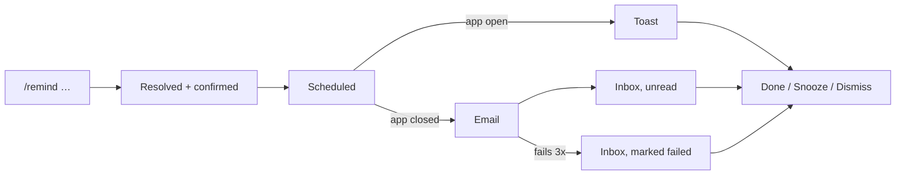

# Design — Reminders and Notifications

> **Gate skipped.** This epic has no approved Epic (stage 0) and no approved PRD
> (stage 1). Drawn ahead of both at the user's explicit direction on 2026-09-17,
> per [`CLAUDE.md`](../CLAUDE.md) §2. Nothing here is approved, and nothing may be
> built from it.

Context: PRD not written. Requirements are sourced to
[the V1 intake](../product/intake/2026-09-08-personal-jarvis-v1.md) §21, §29, §35.
Canvas: none. These artboards are hand-drawn, not Claude Design exports.
Exports: [`./assets/canvas/reminders-design.html`](./assets/canvas/reminders-design.html)

> **No FR ids exist yet.** The Serves column cites intake sections. When the PRD
> is written, every row here needs re-pointing at real FR numbers, and any screen
> that turns out to serve no requirement is deleted rather than kept.

## 1. Design intent

A reminder should feel like something Slashit is holding for you, not a message
it sends at you. It arrives where you already are, it is actionable in one click
at the moment it arrives, and it is never lost: a reminder that fails to reach
you by every channel still waits in the list. The one new control, recurrence,
never blocks capture. The model has already resolved "every Sunday" by the time
you see it, so the editor exists to correct a reading, not to collect one.

## 2. Screen inventory

| Screen | Purpose | Serves | Artboard |
|---|---|---|---|
| Capture | `/remind` resolves date, time and recurrence, confirmed before scheduling | §21, §35, §36 | `Capture` |
| Recurrence editor | Correct what the model read; name the month-length edge case | §21 | `RecurrenceEditor` |
| In-app delivery | A reminder arriving while Slashit is open | §21 | `InAppDelivery` |
| Notification inbox | What arrived while you were away, and what failed | §21 | `NotificationInbox` |
| Reminder email | The out-of-app channel | §21 | `ReminderEmail` |
| Notification settings | Per-channel control and quiet hours | §21 | `NotificationSettings` |
| States | Five required states, plus two delivery failure modes | — | `States` |
| Mobile | Reminders as a tab; delivery as a top sheet | §21 | `Mobile` |

## 3. Flows

| Flow | Entry | Steps | Exit | Serves |
|---|---|---|---|---|
| Schedule | Capture | `/remind …`, model resolves, confirmation card shown | Scheduled, undoable | §21, §35 |
| Correct a reading | Confirmation card, Edit | Recurrence editor, change, save | Rescheduled | §21 |
| Arrive, app open | Due time | Toast, bottom right, three actions | Done, snoozed or dismissed | §21 |
| Arrive, app closed | Due time | Email sent; inbox row created unread | Read on return | §21 |
| Delivery fails | Send error | Retried three times, then held as a row marked failed | Still in the list | §21 |

## 4. States

### Notification inbox

| State | What the user sees | Copy |
|---|---|---|
| Empty | Amber bell in a wash circle, centered | "Nothing to bring back yet" / "Try `/remind Call Mom tomorrow at 7pm`" |
| Loading | Three skeleton rows matching row height, no layout shift | — |
| Error | Red banner, list area empty, retry button | "Reminders could not be loaded. Scheduled ones are unaffected and will still arrive." |
| Success | Rows, unread ones on a blue wash with a dot | — |
| No permission | Not reachable. The route is behind sign-in, so a signed-out user is redirected | — |

### Delivery, the two states 001 has no precedent for

| State | What the user sees | Copy |
|---|---|---|
| Email failed | Amber note, the row stays in the list marked failed | "One reminder could not be emailed. Slashit tried three times. It is in your list here so it is not lost." |
| Past due while away | Blue note above the rows, no replayed pop-ups | "Two reminders came due while you were away. They are at the top, marked unread, not replayed as pop-ups." |

### Recurrence editor

| State | What the user sees | Copy |
|---|---|---|
| Empty | Never empty. It opens pre-filled from what the model read | — |
| Loading | None. Local state only, nothing fetched | — |
| Error | Impossible rule, inline amber note under the field | "Not every month has a 31st. On those months this runs on the last day instead." |
| Success | Blue summary line restating the rule in words, with the next date | "Every Sunday at 7:00 PM. Next on Sun 21 Sep." |
| No permission | N/A | — |

## 5. Responsive behaviour

| Breakpoint | Layout change |
|---|---|
| Mobile (390px) | Reminders becomes the third tab in the bottom bar with a count badge. Delivery is a top sheet, not a corner toast: a bottom-right toast collides with the tab bar and the thumb |
| Tablet | No distinct layout |
| Desktop | Rail gains a Reminders item with an unread count. Toast bottom right, 360px |

## 6. Design system deltas

| Change | Kind | Token or component | Why existing one does not fit |
|---|---|---|---|
| Recurrence editor | added | component | No existing control collects a repeating rule. Segmented period, day grid, and a written summary line |
| Day-of-week grid | added | component | Seven equal cells; `.seg` is one-of-N and does not do multi-select |
| Toast | added | component | 001 has `.note` for in-page guidance, but nothing that arrives unprompted over the surface |
| Notification row | added | component | Unread state, per-row actions. Not a table row, not a record row |
| Bell with count | added | component | New affordance in the topbar |
| Toggle switch | added | component | Settings has selects and segmented controls, no binary switch |
| Quiet-hours row | added | component | Label, description and control on one line, repeated |
| **Email language** | **added** | **component set** | **Email cannot use CSS variables, has no trustworthy dark mode, and needs table layout. Same hex values the tokens resolve to, inlined. See below** |
| Nav count badge | added | component | Red pill in the rail nav |

**The email delta is larger than it looks, and it is not only 003's.** Slashit
sends no designed email today. 002's OTP template (T-1.13) is still unowned and
undesigned, and it needs the same language this epic invents: mark, card, one
primary action, one footer line. Drawn once here for both. If 002's SMTP work
lands first it should use this, not invent a second style.

## 6a. Dark theme

Added 2026-09-17, alongside the rest of this design. Dark reuses **001's
approved palette unchanged** — the eighteen token pairs in its `DarkTokens`
artboard, which the shipped `frontend/src/design-system/tokens.css` already
carries byte-for-byte. **This epic adds no colour token**, and it inherits
001's one dark-specific rule: a primary button inverts to a light blue field
with dark ink on it, never white.

Dark artboards on the canvas: `Capture`, `InAppDelivery`, `NotificationInbox`, `ReminderEmail`. States and mobile panels are not
redrawn in dark — they are the same components on the same tokens, and 001
took the same representative-subset approach rather than doubling its canvas.

**The email does not go dark, in any theme.** §6 already says email has no
trustworthy dark mode: clients rewrite colours unpredictably, and a dark
template that half-applies is worse than one that never changes. The reminder
email keeps its light palette on a dark page, drawn that way in
`Dark · ReminderEmail`. Whoever owns 002's OTP template inherits this rule.

Shadows are the other dark-specific change: the toast and modal shadows swap
from warm ink to black, since a warm shadow on a near-black ground reads as
brown haze rather than depth.

## 7. Accessibility

| Area | Decision |
|---|---|
| Contrast | Unchanged from 001. Amber on amber wash for the reminder marker, already in the ramp |
| Keyboard path | Toast is reachable: focus moves to it on arrival, `Esc` dismisses without acting. Day grid is one tab stop with arrow keys between days, not seven stops |
| Screen reader labels | Toast is `role="alert"`, `aria-live="assertive"` — it is time-critical. Inbox rows are a list; unread state is text, not colour alone. Day cells carry full day names, not "M" |
| Motion and reduced motion | Toast slides in over 180ms. Under `prefers-reduced-motion` it appears without travel |
| Focus order | On the recurrence editor, focus starts on the period segment, the thing most likely wrong |

## 8. Copy

| Location | Text | Notes |
|---|---|---|
| Confirmation card | "Reminder created" | Matches 001's "Task created" |
| Recurrence summary | "Every Sunday at 7:00 PM. Next on Sun 21 Sep." | Always restates the rule in words and gives the next real date |
| Month-length warning | "Not every month has a 31st. On those months this runs on the last day instead." | Names the behaviour rather than silently shifting |
| Toast actions | "Done" / "Snooze 1h" / "Dismiss" | Three, no overflow menu |
| Email subject | "Reminder: Call Mom" | > Assumption: not specified anywhere. Flagged for the design owner |
| Email footer | "You are getting this because you asked Slashit to remind you." | Never "you subscribed" — the user created this, explicitly |
| Both channels off | "With both channels off, reminders still appear in Reminders. Slashit never silently drops one it was asked to keep." | The honesty rule made visible |

## 9. Open questions

| # | Question | Owner | Answer |
|---|---|---|---|
| Q1 | Snooze durations. One hour is drawn; is a menu of options wanted, or is one enough? | user, at PRD | Open |
| Q2 | Does a recurring reminder's snooze affect the series or only this occurrence? Drawn as this occurrence only | user, at PRD | Open |
| Q3 | Is quiet hours in V1 scope, or deferred? Drawn as in scope; it is the main cost driver in this epic's settings | user, at epic | Open |
| Q4 | Email subject line wording | user, at PRD | Open |
| Q5 | Does the email's "Mark done" act without a sign-in, via a signed link? That is a security question, not a design one | user, at build plan | Open |
| Q6 | Should 002's OTP email adopt this language retroactively, and who owns that change? | user | Open |

## Change log

| Date | Change | Why | Approved by |
|---|---|---|---|
| 2026-09-17 | Created, ahead of the epic and PRD gates | User asked for designs of all upcoming slices, to review later | pending |
| 2026-09-17 | Dark theme added (§6a), reusing 001's approved palette unchanged | User asked for dark designs alongside the light ones | pending |
