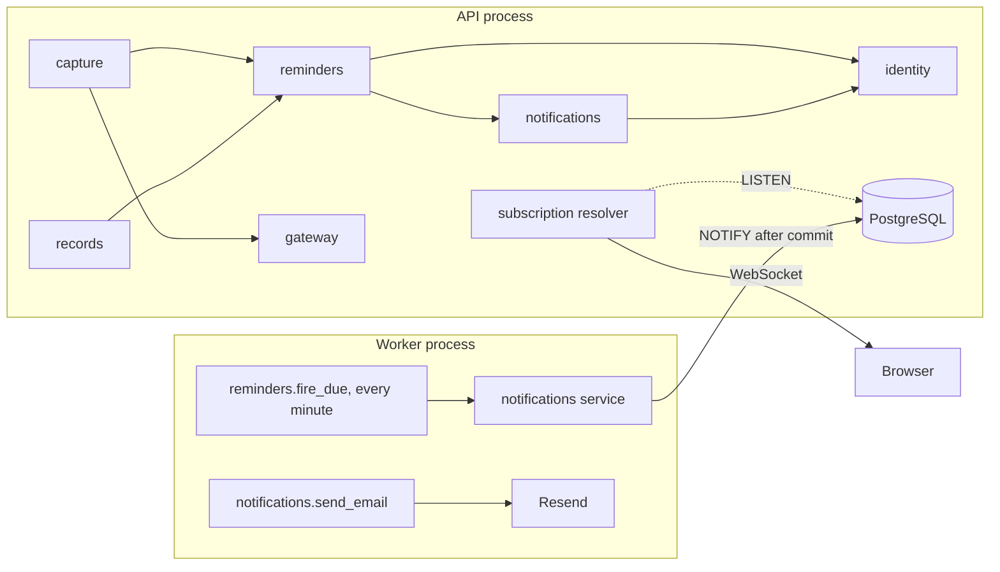

# Build Plan (HLD) — Reminders and Notifications

Context: [PRD](./01-prd.md) · [Design](./02-design.md) · [Tech stack](../tech-stack.md)

Tables this feature touches:

| Table | New or changed |
|---|---|
| `reminders` | new |
| `reminder_firings` | new |
| `notifications` | new |
| `notification_deliveries` | new |
| `user_settings` | changed: four columns added |
| `pending_captures` | changed: one value added to its missing-field enum |

## 1. Architecture summary

Two new backend domains. `reminders` owns the record, its schedule and the
firing. `notifications` owns the list, read state and the two delivery channels.
A Procrastinate job runs every minute in a separate worker process. It fires due
reminders into `notifications`, which writes the list row, signals open apps
through PostgreSQL `LISTEN/NOTIFY` and a GraphQL subscription, and queues one
email job per notification to Resend. `/remind` goes through capture and the
gateway, as `/add-task` does. The model returns plain fields, and the server
computes every fire time with tested code.

## 2. Component map

| Component | Responsibility | Talks to | New or existing |
|---|---|---|---|
| `capture` domain | Parses `/remind` and `/reminders`; asks the one question | gateway, reminders, records | existing, extended |
| `reminders` domain | Reminder CRUD, schedule maths, firing sweep, done, snooze, timezone recompute | notifications, identity | new |
| `notifications` domain | List, unread count, read state, live signal, email job, retention | identity | new |
| `records` domain | Adds reminders to the All tab and record detail | reminders | existing, extended |
| `identity` domain | Timezone, default reminder time, channel switches, account email | none | existing, extended |
| `gateway` domain | The model call for `/remind` | none | existing, unchanged |
| Worker process | Runs every Procrastinate job | database, Resend | new deployment unit |
| Resend | Sends reminder email | none | new integration |
| Frontend | Reminders tab, detail, edit, bell, panel, pop-up, toast, settings | GraphQL over HTTP and WebSocket | existing, extended |

Domain dependencies stay acyclic: capture and records adapt reminders,
reminders adapts notifications and identity, notifications adapts identity.
Identity depends on nothing.

## 3. Data model

| Entity | Key fields | Owns | Lifecycle | Tenancy scope |
|---|---|---|---|---|
| `reminders` | `id`, `user_id`, `description`, `repeat_kind` (none, daily, weekly, monthly, yearly), `repeat_interval`, `repeat_weekdays` smallint[], `local_time`, `anchor_local_date`, `one_time_at` timestamptz, `next_fire_at` timestamptz, `schedule_timezone`, `state` (upcoming, fired, done), `last_fired_at`, `last_action`, `origin`, `original_input`, `created_at`, `updated_at`, `deleted_at` | its firings | Soft-deleted, matching tasks since migration 0013. A deleted row never fires (FR-30) | `user_id` |
| `reminder_firings` | `id`, `reminder_id`, `user_id`, `scheduled_for`, `fired_at`, `lateness` (on_time, late, missed), `action`, `acted_at` | one notification | Kept while its reminder exists | `user_id` |
| `notifications` | `id`, `user_id`, `kind` (reminder, email_paused), `source_id`, `title`, `detail`, `marker` (none, late, missed), `created_at`, `read_at` | its deliveries | Purged 90 days after `created_at` (FR-40) | `user_id` |
| `notification_deliveries` | `id`, `notification_id`, `user_id`, `channel` (popup, email), `status` (queued, sent, failed, skipped), `attempts`, `provider_message_id`, `sent_at` | nothing | Deleted with its notification | `user_id` |
| `user_settings` | adds `default_reminder_time` (09:00), `popups_enabled` (true), `email_enabled` (true), `channels_off_warned_at` | | existing | `user_id` |

Constraints that carry the exactly-once rule (FR-16, NFR-3):

| Constraint | Stops |
|---|---|
| `UNIQUE (reminder_id, scheduled_for)` on `reminder_firings` | The same occurrence firing twice, from two sweeps or a retry |
| `UNIQUE (source_id)` on `notifications` where `kind = reminder` | Two list rows for one firing |
| `UNIQUE (notification_id, channel)` on `notification_deliveries` | Two emails or two pop-ups for one notification |

Every new table enables and forces Row Level Security with an owner policy, and
grants to `authenticated`, in the migration that creates it (T2).

Migrations required: yes. One per domain: `reminders`, `notifications`, and the
`user_settings` and `pending_captures` changes.

## 4. API surface

GraphQL, one endpoint (T1). Every field is `IsAuthenticated`; ownership is
checked in the interactor.

| Operation | Kind | Input | Output | Serves |
|---|---|---|---|---|
| `submitCapture` | mutation, existing | text | adds `ReminderCreated`, `ReminderList`, `ReminderLimitReached` to the union | FR-1 to FR-5, FR-25, FR-38 |
| `answerPendingCapture` | mutation, existing | answer | adds `ReminderCreated` | FR-2 |
| `reminders` | query | group filter, search | grouped list | FR-26 |
| `reminder` | query | id | detail or `ReminderNotFound` | FR-27 |
| `updateReminder` | mutation | id, description, date, time, repeat | reminder, `ReminderNotFound`, `InvalidSchedule` | FR-28 |
| `deleteReminder` | mutation | id | ok or `ReminderNotFound` | FR-29, FR-30 |
| `markReminderDone` | mutation | id | reminder or `ReminderNotFound` | FR-19, FR-20 |
| `snoozeReminder` | mutation | id, `TEN_MINUTES` or `ONE_HOUR` or `TOMORROW` | reminder or `ReminderNotFound` | FR-21 |
| `notifications` | query | cursor, page size 30 | page, newest first | FR-35 |
| `unreadNotificationCount` | query | none | integer | FR-36 |
| `markNotificationRead`, `markAllNotificationsRead` | mutation | id or none | ok | FR-37 |
| `notificationReceived` | subscription | none | notification | FR-13 |
| `settings`, `updateReminderSettings` | query, mutation | time, two switches | settings | FR-31 to FR-34 |

The records `All` query gains reminders through records' port on reminders, so
the All tab stays one call.

## 5. Model and vendor choices

| Use | Choice | Why | Fallback | Est. cost per call | Latency budget |
|---|---|---|---|---|---|
| Reading `/remind` | `gemini-3.6-flash` through the gateway, structured output | Already the capture path; T4 holds | Gateway failure members become the `RemindModelDown` refusal, input kept | about 0.0001 USD, from about 700 tokens in and 100 out at the tech stack's prices, `estimate` | 8 s, as 001's NFR-2 |
| Reminder email | Resend HTTP API | The stack's email vendor | Five retries with backoff, then the delivery is marked failed; the list row stands | free tier at V1 volume, `estimate`, unverified per tech stack §7 | 2 min at p95 (NFR-2) |
| Live signal | PostgreSQL `LISTEN/NOTIFY` | No new infrastructure; crosses the worker and every API instance | Client refetches the list and count on every WebSocket reconnect | none | 5 s at p95 (NFR-5) |

The model returns `description`, `local_date`, `local_time`, `repeat_kind`,
`repeat_interval`, `repeat_weekdays` and `day_of_month`. It is given the user's
timezone and local now, not UTC. It never returns a timestamp; the server builds
one. This fixes task capture too, which today resolves "tomorrow" in UTC.

## 6. Cross-cutting concerns

| Concern | Decision |
|---|---|
| Authentication | Existing Supabase JWT. The WebSocket sends it in `connection_init`; an expired token closes the socket and the client reconnects with a fresh one |
| Authorisation | Interactors load by `(id, user_id)` and return `ReminderNotFound` for another user's id, the same as for a deleted one (NFR-6) |
| Tenant isolation | RLS on all four new tables (T2). The sweep and email jobs run on the service-role connection, as a background job may (T3), and write `user_id` from the reminder row, never from input. Boundary tests: user A reading, editing, snoozing or subscribing to user B's reminder or notification gets nothing (T7) |
| Rate limits and quotas | 100 active reminders per user, checked in the create interactor (FR-38). 50 reminder emails per user per local day, counted from `notification_deliveries` (FR-39). `/remind` counts against the gateway's existing per-user cap |
| Cost controls | The email cap bounds Resend spend. One model call per `/remind`, none per firing |
| Caching | None. MobX stores hold server state; subscription payloads write into the same store method the list query uses |
| Observability | structlog events for fired, late, missed, delivered and failed. Every firing logs its delay, from which NFR-1 is read. An hourly reconciliation job logs an error for any active reminder more than 5 minutes past `next_fire_at` with no firing (NFR-4). Product events go to 001's `events` table for G1 to G4 |
| Failure and retry | Sweep: each reminder in its own transaction, so one bad row never blocks the batch. Email: a Procrastinate job per delivery, idempotency key = delivery id, 5 retries with backoff, `estimate`. `LISTEN` connection: reconnects with backoff; clients refetch on reconnect |
| Data retention and privacy | Notifications purged at 90 days by a daily job. The email carries the reminder text, per PRD Q1; no reminder text in logs or analytics (T6) |

## 7. Alternatives considered

| Decision | Chosen | Alternatives | Why they lost | Reversibility |
|---|---|---|---|---|
| Firing | Every-minute sweep | A timed job per reminder; `pg_cron` | Cancel-on-edit is where duplicates and ghosts come from; `pg_cron` moves logic into SQL, away from tests | cheap |
| Live transport backplane | `LISTEN/NOTIFY` | Redis pub/sub; polling every 30 s | Redis is a new stateful service the stack removed; polling misses NFR-5 | cheap |
| Domain shape | New `reminders` and `notifications` domains | Reminders inside `records` | `records` would grow with every record type in 006 to 009 | costly once built on |
| Outage catch-up | One missed notice, then the next future occurrence | One per occurrence; skip silently | A flood after an outage; skipping breaks FR-18 | cheap |
| Parsing | Model fields, server maths | Model-written RRULE; a rule-based parser | RRULE allows what V1 forbids; parsers miss loose phrasing | cheap |
| Worker | Separate container | Inside the API process | An API restart or scale-to-zero stops reminders firing | cheap |
| Email sending | One job per email | Inline in the sweep | One slow send would delay every reminder in that minute | cheap |
| Schedule storage | Local rule plus `next_fire_at` | Only a UTC instant | A UTC instant cannot follow a timezone change (FR-10) or a clock change (FR-9) | costly |

## 8. Architecture decisions to lock

| # | Decision | Status | Graduates to tech-stack.md or product.md |
|---|---|---|---|
| AD-1 | Two new domains, `reminders` and `notifications`, with the acyclic graph in §2. Future record types get their own domain the same way | proposed | yes, tech stack §3 |
| AD-2 | `reminders.fire_due` runs every minute as a Procrastinate periodic task. It claims due rows with `FOR UPDATE SKIP LOCKED`, at most 500 a run, `estimate` | proposed | no |
| AD-3 | Exactly-once rests on the three unique constraints in §3 and Resend's idempotency key, never on job scheduling | proposed | no |
| AD-4 | Live delivery uses `LISTEN/NOTIFY` on one channel, payload `{user_id, notification_id}` only. Each API instance holds one listening connection and filters by the subscriber's user. This answers tech stack T-Q3 | proposed | yes, closes T-Q3 |
| AD-5 | A schedule is stored in local terms plus `schedule_timezone`, with `next_fire_at` computed by one pure function over `zoneinfo`. Month-end and February 29 clamp to the last day (FR-8) | proposed | no |
| AD-6 | A timezone change reaches reminders as a Procrastinate job deferred by name, `reminders.timezone_changed`, so identity never imports reminders (repo rules §6.3, option 3). Recurring reminders recompute; one-time reminders keep their instant (FR-10, FR-11) | proposed | no |
| AD-7 | Capture passes the user's timezone and local now to every extraction, `/add-task` included. This changes 001's behaviour and is logged against 001 | proposed | no |
| AD-8 | Resend is called only from `notifications/services/`, the one place a vendor SDK may sit (repo rules §6.3) | proposed | no |
| AD-9 | The worker runs as its own container, `procrastinate worker`, separate from the API | proposed | yes, tech stack §1 hosting |
| AD-10 | Reminder settings are columns on identity's `user_settings`, read by the other domains through identity's `public.py` | proposed | no |
| AD-11 | Lateness is set at firing. On time within 5 minutes of `scheduled_for`; late up to 24 hours; missed beyond. A recurring reminder past 24 hours produces one missed notice for its latest occurrence, then moves to the next future one | proposed | no |
| AD-12 | A local time that does not exist on a clock-change day fires at the first valid minute after it. A time that occurs twice fires once, at the first | proposed | no |

## 9. Risks

| Risk | Impact | Mitigation | Trigger to revisit |
|---|---|---|---|
| The worker stops and nobody notices | Every reminder silently late | Hourly reconciliation (NFR-4) logs an error; the host restarts a dead container | Any reconciliation error in production |
| The sweep takes longer than a minute | Firing drifts past NFR-1 | 500-row cap, per-row transactions, delay logged per firing | p95 delay over 30 s |
| The `LISTEN` connection drops quietly | Pop-ups stop; the list is still correct | Reconnect with backoff; clients refetch on reconnect | A gap between firings and pop-up receipts |
| Reminder email lands in spam | Channel useless for that user | `reminders@` on the user's own verified domain with SPF and DKIM, Q9; bounce and complaint events logged | Complaint rate above zero in week one |
| Supabase free tier pauses the project | Nothing fires | Open as tech stack T-Q6; move to Pro before real users | Before launch |
| Model misreads a repeat phrase | Wrong schedule | FR-5 echoes it in words; server maths is exact | Edits to repeat right after capture |
| AD-7 changes how 001 reads dates | A task's due date shifts for users outside UTC | Logged as a change against 001; test cases in both zones | none |

## 10. Questions for the user

Every question is answered, each as the recommended option: Q1 to Q8 before drafting, Q9 to Q11 after.

| # | Question | Options | Recommendation | Answer |
|---|---|---|---|---|
| ~~Q1~~ | How are reminders fired? | Every-minute sweep · a job per reminder · `pg_cron` | Sweep | **Sweep**, 2026-09-23. AD-2 |
| ~~Q2~~ | How do live pop-ups reach an open app? | `LISTEN/NOTIFY` · Redis · polling | `LISTEN/NOTIFY` | **`LISTEN/NOTIFY`**, 2026-09-23. AD-4 |
| ~~Q3~~ | Where does reminder code live? | New domain · inside records | New domain | **New domain**, 2026-09-23. AD-1 |
| ~~Q4~~ | Outage catch-up for a recurring reminder | One missed notice · one per occurrence · skip | One missed notice | **One missed notice**, 2026-09-23. AD-11 |
| ~~Q5~~ | How is a repeat phrase parsed? | Model fields and server maths · model RRULE · rule parser | Model fields | **Model fields**, 2026-09-23. §5 |
| ~~Q6~~ | Fix task capture's UTC dates too? | Both in one change · reminders only · a separate 001 fix first | Both | **Both**, 2026-09-23. AD-7 |
| ~~Q7~~ | Where does the worker run? | Separate container · inside the API | Separate | **Separate**, 2026-09-23. AD-9 |
| ~~Q8~~ | How are emails sent? | Resend, one job each · inline in the sweep | One job each | **One job each**, 2026-09-23. AD-8 |
| ~~Q9~~ | Which address sends reminder email? It needs a domain the user owns, verified in Resend | **(Recommended)** `reminders@` on a domain you own, verified with SPF and DKIM · Resend's shared test domain, for development only · the address 002's auth emails use today | Own domain | **`reminders@` on your own domain**, 2026-09-23. The domain name itself is still to be supplied; it blocks the first real email, not this plan |
| ~~Q10~~ | When does a firing count as late? | **(Recommended)** More than 5 minutes after its time · more than 1 minute · more than 15 minutes | 5 minutes | **More than 5 minutes**, 2026-09-23. AD-11 |
| ~~Q11~~ | Clock-change days: a 2:30 AM reminder on a day 2:30 does not exist | **(Recommended)** Fire at the first valid minute after · skip that day · fire an hour early | First valid minute | **First valid minute after**, 2026-09-23. AD-12 |

## Change log

| Date | Change | Why | Approved by |
|---|---|---|---|
| 2026-09-23 | Created after design approval, with Q1 to Q8 answered by the user before drafting | Design approved | pending |
| 2026-09-23 | Q9 to Q11 answered: own sending domain, late after 5 minutes, first valid minute on a clock-change day | User chose the recommended options | user |
