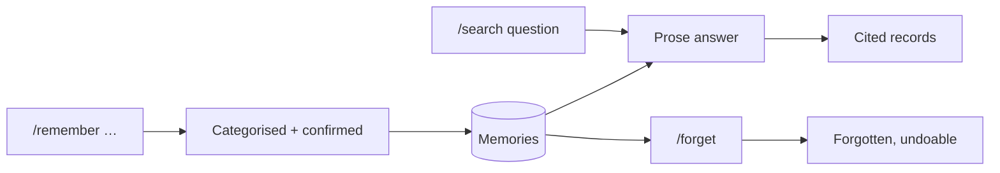

# Design — Persistent Memory

> **Gate skipped.** No approved Epic (stage 0), no approved PRD (stage 1). Drawn
> ahead of both at the user's explicit direction on 2026-09-17, per
> [`CLAUDE.md`](../CLAUDE.md) §2. Nothing here is approved.

Context: PRD not written. Sourced to
[the V1 intake](../product/intake/2026-09-08-personal-jarvis-v1.md) §15 to §18, §35.
Canvas: none. Hand-drawn artboards, not Claude Design exports.
Exports: [`./assets/canvas/memory-design.html`](./assets/canvas/memory-design.html)

> **No FR ids exist yet.** Serves cites intake sections. Re-point at real FR
> numbers when the PRD is written.

## 1. Design intent

Memory is the stated differentiator, so it has to feel like being known rather
than like a database you maintain. Three decisions carry that. Category is
resolved by the model and shown as a correctable field, never asked for up
front. Recall answers in a sentence and shows its sources underneath, so being
known never costs you the ability to check. And forgetting is its own act, with
its own words, distinct from deleting a row.

## 2. Screen inventory

| Screen | Purpose | Serves | Artboard |
|---|---|---|---|
| Capture | `/remember`, with the resolved category shown | §16, §36 | `Capture` |
| Recall | Slashit answers in prose, citing the memories behind it | §17 | `Recall` |
| Memories | `/memories`, grouped by category | §15, §16, §18 | `Memories` |
| Forget | `/forget`, quoting the memory and naming what stops | §18, §35 | `Forget` |
| States | Five required states, plus nothing-remembered | — | `States` |
| Mobile | 390 × 844 | §15 to §18 | `Mobile` |

## 3. Flows

| Flow | Entry | Steps | Exit | Serves |
|---|---|---|---|---|
| Remember | Capture | `/remember …`, model extracts and categorises, card confirms | Saved, undoable | §16, §35 |
| Recall | Capture | `/search <question>`, prose answer with citations | Answer, sources one click away | §17 |
| Browse | Memories | Grouped list, filter by category | — | §15 |
| Forget | Memories or `/forget` | Modal quotes the memory, names the consequence | Forgotten, undoable | §18 |

## 4. States

### Recall

| State | What the user sees | Copy |
|---|---|---|
| Empty | Never empty on its own. Before any memory exists, the Memories empty state stands in | — |
| Loading | Answer block with a spinner and a line of text, not a skeleton — the shape of the answer is unknown | "Looking through what I remember…" |
| Error | Red note. Says explicitly that nothing was changed | "Recall failed. Nothing was changed, and nothing was forgotten." |
| Success | Prose answer, blue left rule, citation chips beneath a hairline | — |
| Nothing on this topic | Same block, grey rule, no citations. **Not an error state** | "I do not have anything recorded about your car." |
| No permission | Not reachable. Memories are per-account behind sign-in | — |

### Memories

| State | What the user sees | Copy |
|---|---|---|
| Empty | Blue mark in a wash circle, centered | "Slashit remembers nothing yet" / "Try `/remember My passport expires in 2030`" |
| Loading | A category heading skeleton and two row skeletons | — |
| Error | Red note, retry | "Memories could not be loaded." |
| Success | Rows grouped under category headings, count per group | — |
| No permission | Not reachable, as above | — |

### Forget

| State | What the user sees | Copy |
|---|---|---|
| Empty | N/A, always opened against one memory | — |
| Loading | Button shows a spinner, modal stays open | "Forgetting…" |
| Error | Red note inside the modal, memory unchanged | "Could not forget that. It is still saved." |
| Success | Modal closes, blue note with an undo | "Forgotten. Undo" |
| No permission | N/A | — |

## 5. Responsive behaviour

| Breakpoint | Layout change |
|---|---|
| Mobile (390px) | Memories is a bottom-bar tab. Rows drop the inline Edit and open on tap. Category headings stay — they are the only structure a memory list has |
| Tablet | No distinct layout |
| Desktop | Category filter as tabs in the topbar, search beside it |

## 6. Design system deltas

| Change | Kind | Token or component | Why existing one does not fit |
|---|---|---|---|
| Answer block | added | component | **The first surface where Slashit speaks in sentences.** 001's card is a field grid; this is prose with sources. Blue left rule marks it as Slashit's voice, not a record |
| Citation chip | added | component | Kind label plus text, compact. Not a pill (that is status) and not a record row |
| Category group heading | added | component | Label, rule, count. Records has no grouped list |
| Memory row | added | component | Single line of text plus category. Lighter than a record row; a memory has no date or status |
| Forget confirmation | changed | `DeleteConfirm` | Same modal shape as 001, different mark, and it quotes the memory in a block rather than naming it inline |

## 7. Accessibility

| Area | Decision |
|---|---|
| Contrast | Unchanged from 001. Blue on blue wash for the answer rule is already in the ramp |
| Keyboard path | Citation chips are links in the tab order, after the answer text. Category filters are a tab list with arrow keys |
| Screen reader labels | The answer block is `aria-live="polite"` — it replaces content in place after a query. Citations are a labelled list, "3 sources", not loose chips |
| Motion and reduced motion | The recall spinner is the only motion; under `prefers-reduced-motion` the text stands alone |
| Focus order | After an answer renders, focus stays in the input. The user is likely to ask again |

## 8. Copy

| Location | Text | Notes |
|---|---|---|
| Capture footer | "Slashit chose the category. Change it any time." | Makes the inference visible and reversible in one line |
| Nothing remembered | "I do not have anything recorded about your car." | First person, no apology, no error styling |
| Forget consequence | "Slashit will stop using this when it answers you. Records that mention it are not deleted." | The one thing a user cannot guess |
| Forget actions | "Keep it" / "Forget" | Not "Cancel" — the safe option says what it does |
| After forgetting | "Forgotten. Undo" | |
| Correction affordance | "That is wrong" | Sits beside every answer. > Assumption: what it does is unspecified; flagged as Q2 |

## 9. Open questions

| # | Question | Owner | Answer |
|---|---|---|---|
| Q1 | Are the four categories (Personal, People, Professional, Life) fixed, or user-editable? Drawn as fixed, with a free sub-label | user, at epic | Open |
| Q2 | What does "That is wrong" do — edit the memory, re-run recall, or record feedback? | user, at PRD | Open |
| Q3 | Is `/forget` reversible after the undo window closes, or permanent? Drawn as undoable for one action | user, at PRD | Open |
| Q4 | Does recall read memories only, or every record type? Drawn citing a Project, which makes it cross-type and overlaps 005 | user, at epic | Open |
| Q5 | Is there a memory limit per account, and what does hitting it look like? 001 has a quota refusal pattern to reuse | user, at build plan | Open |

## Change log

| Date | Change | Why | Approved by |
|---|---|---|---|
| 2026-09-17 | Created, ahead of the epic and PRD gates | User asked for designs of all upcoming slices, to review later | pending |
