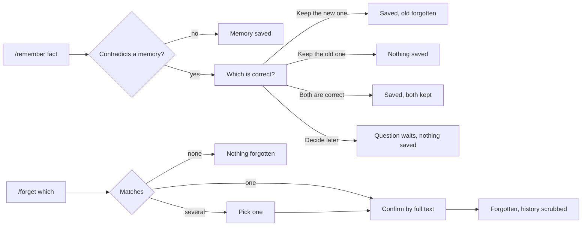

# Design — Persistent Memory

Context: [PRD](./01-prd.md)
Canvas: https://claude.ai/artifact/Lg26vefNMHyJenHNEFxsZJ
Exports: `./assets/canvas/`, one `.dc.html` per artboard, `canvas.json` for
the layout, `slashit-persistent-memory.html` as the packaged canvas.
Generated from 001's own artboards, so every token, the rail and the mobile
chrome are 001's values unchanged.

## 1. Design intent

A memory is the quietest record in Slashit: one line in the user's own words,
never rewritten. Every surface reuses 001's capture turns, records table,
detail page and confirm modal, so memory adds one record type rather than a new
way of working. The two new moments are the ones where Slashit acts on what the
user already holds. A conflict puts the new and old facts side by side and
never chooses for the user. A forget always names the full text that will go,
and states that the words also leave capture history.

## 2. Screen inventory

| Screen | Purpose | Serves | Canvas artboard |
|---|---|---|---|
| Memory saved | `/remember` result card: text, category, Edit, Open in Records. Also `/memories` listing above it | FR-1, FR-2, FR-5, FR-7, FR-19 | `MemorySaved` |
| Secret caution | The saved card with a one-line amber caution | FR-8 | `MemorySecretCaution` |
| Conflict question | New beside old, three answers, "Decide later" | FR-10 to FR-13 | `Main` |
| Lookup | `/memories <text>` matches, newest first, with "See all in Records" | FR-20 | `MemoriesLookup` |
| Forget, pick one | `/forget` with several matches: a pick list | FR-25 | `ForgetPick` |
| Forget, confirm | Inline confirm naming the full text, with the backup line | FR-24, FR-29 | `ForgetConfirm` |
| Forget all | Count-stating confirm | FR-27, FR-29 | `ForgetAll` |
| History after forget | Placeholder turn, and "Forgot 1 memory" with no words | FR-23, FR-28 | `HistoryForgotten` |
| Capture states | No fact, over 500 characters, model unavailable, lookup no match, forget no match | FR-3, FR-4, FR-9, FR-20, FR-26 | `CaptureStates` |
| Memories in Records | Memories tab, category chips, table of text, category, saved date | FR-15, FR-16 | `RecordsMemories` |
| All records | A memory row among tasks, blue dot, category in the status column | FR-15 | `RecordsAll` |
| Memory detail | Text as the title, category, saved, last edited, origin, what you typed, Edit, Forget | FR-17 | `MemoryDetail` |
| Memory edit | Text with a 500 counter, category segmented control | FR-18, FR-14 | `MemoryEdit` |
| Forget from detail | Modal confirm naming the full text | FR-21, FR-29 | `ForgetDetailConfirm` |
| Memories states | Empty, loading, error, filtered empty, no permission, forgotten | FR-15, FR-22 | `MemoriesStates` |
| Mobile conflict, list, detail | The same at 390x844 | FR-10, FR-11, FR-15, FR-17 | `MobileConflict`, `MobileMemories`, `MobileMemoryDetail` |

`Main` is the conflict artboard. The canvas format requires an entry file of
that name, and the conflict question is this feature's defining screen.

### Dark theme

`DarkMemoryConflict`, `DarkRecordsMemories`, `DarkMemoryDetail`,
`DarkForgetDetailConfirm`, `DarkMobileConflict`, `DarkMobileMemories` apply
001's dark token block exactly. The only dark-specific values are the
highlighted "New" side and the selected category chip, listed in §6.

## 3. Flows

| Flow | Entry | Steps | Exit | Serves |
|---|---|---|---|---|
| Save | `/remember <fact>` | Submit, the saved card appears in place | Memory saved, or a caution on the card | FR-1 to FR-8 |
| Save with conflict | `/remember <fact>` | Submit, the conflict card appears, the user picks an answer now or later | Saved and old forgotten, discarded, or both kept | FR-10 to FR-13 |
| Look up | `/memories <text>` | Submit, matches appear | Matches, or "No memories match" | FR-19, FR-20 |
| Forget by command | `/forget <which>` | One match: confirm. Several: pick, then confirm. None: say so | Forgotten, or nothing changed | FR-24 to FR-28 |
| Forget from Records | Memory detail, Forget | Modal confirm | Back to Memories with a "Memory forgotten" note | FR-21, FR-22 |
| Edit | Memory detail, Edit | Change text or category, save | Detail with "Last edited" updated. No conflict check | FR-14, FR-18 |

## 4. States

### Conflict question (`Main`)

| State | What the user sees | Copy |
|---|---|---|
| Empty | N/A. The card exists only once a conflict is found | — |
| Loading | 001's capture loading turn while the check runs, then the card | 001's existing copy |
| Error | Model unavailable before the check: the save is refused, text kept | "Slashit could not save this right now." See `CaptureStates` |
| Success | Card resolves into the matching outcome turn: saved, discarded or both kept | "Memory saved", "Kept your earlier memory", "Saved. Both memories kept" |
| No permission | N/A. Capture is only reachable signed in, per 002 | — |
| Waiting | Card stays, "1 question waiting" pill above the input | "Nothing saved yet · answer whenever you like" |

### Forget by command (`ForgetPick`, `ForgetConfirm`, `ForgetAll`)

| State | What the user sees | Copy |
|---|---|---|
| Empty | No match card | "No memory matches “…”. Nothing was forgotten." |
| Loading | 001's capture loading turn while matching | 001's existing copy |
| Error | Model unavailable: refused as in 001's FR-35, text kept | 001's quota refusal copy |
| Success | History row "Forgot 1 memory" | "Memory forgotten." |
| No permission | N/A, signed in only | — |

### Memories in Records (`RecordsMemories`, `MemoriesStates`)

| State | What the user sees | Copy |
|---|---|---|
| Empty | Serif heading and an example command | "Nothing remembered yet" |
| Loading | Three skeleton rows | — |
| Error | Red note with Try again | "Your memories could not be loaded. Nothing is lost." |
| Success | Table, count in the footer | "6 memories · Only you can see these" |
| No permission | Blue note, session ended | "Sign in to see your memories." |
| Filtered, no match | Centred note | "No memories in Professional" |

### Memory detail and edit (`MemoryDetail`, `MemoryEdit`, `ForgetDetailConfirm`)

| State | What the user sees | Copy |
|---|---|---|
| Empty | N/A. A detail always has a memory | — |
| Loading | 001's detail skeleton | — |
| Error | Save fails: 001's inline field error, text kept. Over 500: counter turns red, Save disabled | "A memory can be up to 500 characters." |
| Success | Detail with "Last edited" set, or Memories with "Memory forgotten" | "Memory forgotten. It is gone from your records and your capture history." |
| No permission | A memory from another account resolves as not found, never "forbidden" | 001's not-found copy |

## 5. Responsive behaviour

| Breakpoint | Layout change |
|---|---|
| Mobile (390px) | Conflict card stacks new above old and turns the three answers into full-width buttons. The table becomes 001's two-line rows with the category chip on the right. Category chips scroll sideways |
| Tablet | No distinct layout. The 760px capture column and the records table flex as in 001 |
| Desktop | As drawn at 1440x900 |

## 6. Design system deltas

| Change | Kind | Token or component | Why existing one does not fit |
|---|---|---|---|
| Category tag (`.cat`, `.cat.none`) | added | component | 001's `.pill` carries state colours. A category is not a state, so it is neutral, dashed when absent |
| Category filter chips (`.chips`, `.chip`) | added | component | 001's `.tab` filters by type. Chips filter within one type, a second level the tabs cannot show |
| Memory type dot (`.dot.mem`) | added | component | 001's `.dot` is amber and square for tasks. A memory is blue and round so the All view tells them apart without reading |
| Conflict pair (`.pair`, `.side`, `.side.new`) | added | component | No 001 component compares two records |
| Answer rows (`.choice`, `.radio`, `.pick`) | added | component | 001's pending question takes free text. This one takes a single choice |
| History placeholder (`.ghostturn`) | added | component | A turn with no words has no 001 equivalent |
| Dark values for `.side.new`, `.chip.on` | added | tokens | Same names, dark values `#1f2630` and ink on paper |
| Everything else | reused | tokens, components | 001's `RecordDetail` stylesheet, unchanged |

No one-off styles outstanding.

## 7. Accessibility

| Area | Decision |
|---|---|
| Contrast | 001's pairs throughout. `.cat` uses `--ink2` on `--rail`, already an approved 001 pair |
| Keyboard path | Conflict answers are one radio group, arrow keys move, Enter submits. Forget pick list is the same pattern |
| Screen reader labels | The conflict card is a group labelled "Which is correct?", each side announced as "New" or "Saved before". The forget confirm announces the full memory text |
| Motion and reduced motion | Only 001's skeleton shimmer and spinner, already reduced-motion aware |
| Focus order | On a conflict, focus moves to "Keep the new one". On any forget confirm, focus starts on Cancel, since the action is permanent |

## 8. Copy

| Location | Text | Notes |
|---|---|---|
| Saved card | "Memory saved" | |
| Secret caution | "This looks like a card number or PIN. It is saved, and only you can see it. Slashit sends saved text to its AI model when it checks for conflicts, so you may prefer to keep secrets elsewhere." | Names why. Never blocks, per FR-8 |
| Conflict head | "Which is correct?" · "Nothing saved yet · answer whenever you like" | |
| Conflict answers | "Keep the new one" · "Keep the old one" · "Both are correct" | "Keep the new one" names the memory it forgets, per FR-12 |
| Forget confirm | "Forget this memory? {text} will be removed for good, and its words removed from your capture history. This cannot be undone." | |
| Forget all | "Forget all {n} memories?" · button "Forget {n} memories" | Count in the button too |
| Backup line | "Copies in backups are erased within {backup window}." | Placeholder until PRD Q6 sets the window |
| History placeholder | "A memory was saved here and later forgotten" | FR-23 |
| Forget history row | "Forgot 1 memory" | FR-28 |
| Too long | "That is {n} characters. A memory can be up to 500." | |
| Model down | "Slashit could not save this right now. Its AI model is unavailable, so it cannot check this against your other memories. This is temporary." | FR-9 |
| No match | "No memories match “{text}”" · "Matching is by word." | Sets the keyword-only expectation |

## 9. Open questions

| # | Question | Owner | Answer |
|---|---|---|---|
| Q1 | The Records tabs show Reminders, from epic 003, which is built on another branch and not yet merged. Keep it drawn? | user | Open |
| Q2 | Should the secret caution mention the AI model at all, or only say "only you can see it"? | user | Open |
| Q3 | The backup window in the copy is a placeholder until PRD Q6 is answered in the build plan | tech-stack | Open |

## Change log

| Date | Change | Why | Approved by |
|---|---|---|---|
| 2026-09-25 | Created. 24 artboards across Capture, Records, Mobile and Dark theme pages, generated from 001's artboards | PRD approved, user asked for design | pending |
