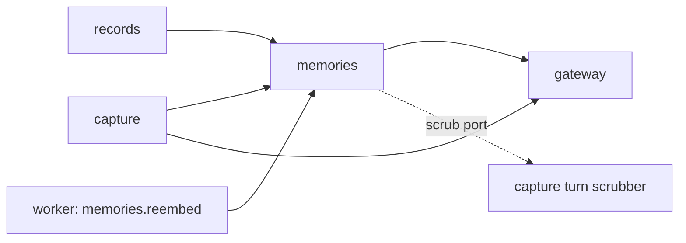

# Build Plan (HLD) — Persistent Memory

> **Approved** by @user on 2026-09-25. Locked — changes require a change record (§7).

Context: [PRD](./01-prd.md) · [Design](./02-design.md) ·
[Tech stack](../tech-stack.md) ·
[003 build plan](https://github.com/SSC369/slashit/blob/claude/next-steps-fe8oyg/process-docs/003-reminders-and-notifications/03-build-plan.md)

Tables touched:

- `memories`: new
- `capture_turns`: changed, gains `resulting_memory_id` and `forgotten_at`, new outcomes
- `pending_captures`: changed, gains a conflict kind and three columns
- `ai_usage`: changed, gains `operation`
- `events`: changed, new event types

> Built on 003. Decided 2026-09-25: 004's dev starts once epic 003 is merged to
> `main`. 003 changes the same capture, records and wiring files, and its
> patterns bind here: one domain per record type (003 AD-1), soft delete
> everywhere, migrations numbered after 003's `0022`.

## 1. Architecture summary

A new `memories` domain owns the record, its category, its meaning vector and
forget. Every save runs through capture as `/add-task` does. Memories embeds the
fact, picks the ten nearest of the user's memories by vector distance, and makes
one structured model call that returns the category and which of those ten the
fact contradicts. No contradiction saves the memory. A contradiction stores a
pending conflict in capture's existing `pending_captures`, answered later by a
new mutation. Forget is a tombstone: the row stays with `deleted_at` set and
every readable column wiped, and capture history loses the words in the same
transaction.

## 2. Component map

| Component | Responsibility | Talks to | New or existing |
|---|---|---|---|
| `memories` domain | Memory CRUD, category, embedding, candidate search, conflict judgement, keyword lookup, forget and tombstone, secret check | gateway, capture's scrub port | new |
| `capture` domain | Parses `/remember`, `/add-memory`, `/memories`, `/forget`; stores the pending conflict; records turns; scrubs turns on request | memories, gateway | existing, extended |
| `gateway` domain | Adds `embed`, beside `extract`. Attributes and caps both | none | existing, extended |
| `records` domain | Adds memories to the All tab | memories | existing, extended |
| `analytics` domain | New event types | none | existing, extended |
| Worker process | `memories.reembed` after an edit | database, gateway | existing, from 003 |
| Frontend | Capture cards, conflict card, Memories tab, detail, edit, forget confirms | GraphQL | existing, extended |



The dependency graph stays acyclic. Memories needs capture history scrubbed, but
must not import capture. Memories declares a `TurnScrubPort`; capture implements
it in an adapter wired in `core/deps.py`, the same inversion 003 used for the
timezone job (003 AD-6).

## 3. Data model

| Entity | Key fields | Owns | Lifecycle | Tenancy scope |
|---|---|---|---|---|
| `memories` | `id`, `user_id`, `text` (nullable), `category` (personal, people, professional, life, nullable), `embedding vector(768)` (nullable), `search_vector tsvector` generated from `text`, `origin` (command, edit), `original_input` (nullable), `created_at`, `updated_at`, `deleted_at` | nothing | Tombstoned on forget: `deleted_at` stamped, `text`, `original_input`, `category`, `embedding` set to NULL in one `UPDATE` | `user_id` |
| `capture_turns` | adds `resulting_memory_id`, `forgotten_at`. Outcomes add `memory_saved`, `memory_listed`, `memory_forgotten`, `memory_conflict_resolved` | | Stays append-only except one permitted `UPDATE`: the scrub sets `forgotten_at` and blanks `input_text`, `question_text`, `answer_text` | `user_id` |
| `pending_captures` | `missing_field` adds `fact` and `memory_conflict`; adds `candidate_text`, `candidate_category`, `conflicting_memory_ids uuid[]` | | Deleted on resolution, as today | `user_id` |
| `ai_usage` | adds `operation` (generate, embed), default `generate` | | existing | `user_id` |
| `events` | `event_type` adds `memory_saved`, `memory_lookup`, `memory_conflict_answered`, `memory_forgotten`, `memory_category_edited`, `memory_secret_caution` | | Insert-only, never holds text (T6) | `user_id` |

Two check constraints make forget a database guarantee rather than a code path:

```sql
-- memories: a forgotten row holds nothing readable
CHECK (deleted_at IS NULL OR (text IS NULL AND original_input IS NULL
       AND category IS NULL AND embedding IS NULL))
-- capture_turns: a forgotten turn holds no words
CHECK (forgotten_at IS NULL OR (input_text = '' AND question_text IS NULL
       AND answer_text IS NULL))
```

A `/forget` turn is always recorded with `input_text = '/forget'`, whatever was
typed, whether or not it was confirmed. This goes one step past FR-28, because
an unconfirmed `/forget my passport number` carries the fact too.

Migrations required: yes. `0023_pgvector` enables the extension. `0024_memories`
creates the table, with RLS forced, its policy and the `authenticated` grant
(T2). `0025_capture_memory` changes `capture_turns` and `pending_captures`.
`0026_usage_operation` and `0027_memory_events` change the last two. Numbers
assume 003 lands at `0022`.

## 4. API surface

GraphQL, one endpoint (T1). Every field is `IsAuthenticated`. Ownership is
checked in the interactor, and a tombstoned id reads as not found.

| Operation | Kind | Input | Output | Serves |
|---|---|---|---|---|
| `submitCapture` | mutation, existing | text | union adds `MemorySaved` (with `secretCaution`), `MemoryConflictAsked`, `MemoryList`, `ForgetCandidates`, `MemoryTooLong`. Gateway failures pass through unmapped, as today | FR-1 to FR-10, FR-19, FR-20, FR-24 to FR-27 |
| `answerPendingCapture` | mutation, existing | answer to "What should Slashit remember?" | as `submitCapture` for a save | FR-3 |
| `resolveMemoryConflict` | mutation | pending id, `KEEP_NEW`, `KEEP_OLD` or `BOTH` | `MemorySaved`, `MemoryDiscarded`, `PendingCaptureNotFound` | FR-11 to FR-13 |
| `memories` | query | category, search | list, newest first | FR-15, FR-16 |
| `memory` | query | id | `Memory` or `MemoryNotFound` | FR-17 |
| `updateMemory` | mutation | id, text, category | `Memory`, `MemoryNotFound`, `MemoryTooLong` | FR-14, FR-18 |
| `forgetMemory` | mutation | id | `MemoryForgotten` or `MemoryNotFound` | FR-21 to FR-24 |
| `forgetAllMemories` | mutation | `expectedCount` | `MemoriesForgotten` or `MemoryCountChanged` | FR-27 |
| `records` | query, existing | | All tab gains memories through records' port | FR-15 |
| `captureHistory` | query, existing | | `CaptureTurn` gains `forgotten` | FR-23, FR-28 |

`forgetAllMemories` carries the count the user confirmed. A memory saved in
another tab between confirm and submit changes the count, and the mutation
refuses rather than forgetting something the user never saw.

## 5. Model and vendor choices

| Use | Choice | Why | Fallback | Est. cost per call | Latency budget |
|---|---|---|---|---|---|
| Category and conflict judgement | `gemini-3.6-flash` through `gateway.extract`, structured output `{category, conflicting_ids[]}` | Already the capture path; one call does both jobs | Any gateway failure refuses the save, text kept (FR-9) | about 0.00005 USD, from about 350 tokens in and 40 out at the tech stack's prices, `estimate` | 8 s p95 (NFR-4), measured 5.3 to 8.5 s in 001 |
| Meaning vector | Gemini embedding model through a new `gateway.embed`, 768 dimensions. The model name is confirmed against Google's current list at build, as 001 had to for `gemini-3.6-flash` | Tech stack §3 chose pgvector with Gemini embeddings; 005 reuses the vectors | Same refusal as above on save. On edit, the job retries | under 0.00001 USD, about 30 tokens, `estimate` | 1 s, `estimate`, inside NFR-4's 8 s |
| Candidate search | pgvector cosine distance, the user's ten nearest non-forgotten memories | Catches contradictions that share no words | None needed; a user with no memories sends an empty list | none | under 100 ms at 1,000 memories, `estimate` |
| Keyword lookup | PostgreSQL full-text search on `search_vector`, `english` configuration, terms OR-ed and ranked by matches | FR-20 is keyword-only; stems "careers" to "career" and drops "what" and "my" | None | none | NFR-5, 1 s |

Product words such as "remember", "memory" and "know" join the stop list in
code, so `/memories what do you remember about my career` searches "career".

## 6. Cross-cutting concerns

| Concern | Decision |
|---|---|
| Authentication | Existing Supabase JWT, unchanged |
| Authorisation | Interactors load by `(id, user_id)` with `deleted_at IS NULL`. Another user's id and a forgotten id both return `MemoryNotFound` |
| Tenant isolation | RLS on `memories` (T2). The candidate search runs on the request's `authenticated` connection, so only the caller's memories can reach a prompt (NFR-1, principle 7). Boundary tests: user A reading, editing, forgetting, or being offered user B's memory as a conflict candidate gets nothing (T7) |
| Rate limits and quotas | A save counts one `generate` against the gateway's per-user cap, today 20 requests a day. `embed` calls are recorded in `ai_usage` per user but never counted against the cap (Q5). An edit costs one uncounted `embed`, in the worker |
| Cost controls | One generation per save, none per lookup or forget. Candidates capped at ten, so a prompt does not grow with the user's memory count |
| Caching | None. MobX stores hold server state, per the tech stack |
| Observability | A structlog processor drops the keys `text`, `fact`, `input_text`, `original_input`, `candidate_text` and `prompt` from every log line, with a test (NFR-3). Events carry ids and counts only. Save latency is logged per call, split by memory count, for NFR-4 |
| Failure and retry | A save is one transaction: memory insert and turn. `KEEP_NEW` is one transaction: tombstone the old, insert the new, scrub the old turns, delete the pending row. `memories.reembed` retries three times, then leaves `embedding` NULL and logs; a NULL vector is simply not a candidate |
| Data retention and privacy | Forget tombstones the memory and scrubs its turns, enforced by the §3 constraints. Backups age out on the project's schedule. The window is deferred to launch by the user on 2026-09-25: it is read from the project's backup settings then, and fills the design's `{backup window}`. Until then the copy keeps the placeholder. Prompt content never reaches `ai_usage` or `events` (T6). If Langfuse is deployed later, memory calls are excluded from tracing |

## 7. Alternatives considered

| Decision | Chosen | Alternatives | Why they lost | Reversibility |
|---|---|---|---|---|
| Forget storage | Tombstone with wiped columns | Hard delete; soft delete keeping text | Hard delete breaks the standing soft-delete rule; keeping text breaks FR-22 and NFR-2. Chosen by the user 2026-09-25 | costly once data exists |
| Conflict candidates | Embedding nearest ten, then one model call | Full-text prefilter; every memory in the prompt | Prefilter misses contradictions sharing no words; all memories costs about 15,000 tokens at 1,000 memories. Chosen by the user 2026-09-25 | cheap |
| Where the conflict waits | `pending_captures` with a new kind | A `memory_conflicts` table in memories | A second pending store would split the "1 question waiting" count and 001's answer-later rules | cheap |
| Category and conflict | One structured call | Two calls; a classifier without a model | Two calls double latency past NFR-4; rules cannot place free text into four categories | cheap |
| Secret check | Deterministic patterns in memories | Ask the model | Must hold when the model is down, must be testable, and costs nothing | cheap |
| Re-embed on edit | Worker job | Inline in `updateMemory` | An edit would fail on a model outage, which FR-18 does not allow | cheap |
| History scrub | Port owned by memories, implemented by capture | Memories importing capture; a database trigger | Import breaks the acyclic rule; a trigger hides behaviour from tests | cheap |

## 8. Architecture decisions to lock

| # | Decision | Status | Graduates to tech-stack.md or product.md |
|---|---|---|---|
| AD-1 | New `memories` domain, per 003 AD-1 | locked | no, 003 already graduates it |
| AD-2 | Forget is a tombstone, enforced by check constraints. Memories are the one record type whose content is erased, not only hidden | locked | yes, product.md: the soft-delete rule's one exception for content |
| AD-3 | `capture_turns` is append-only except for the scrub `UPDATE`, which is the only way its text changes | locked | no |
| AD-4 | pgvector is enabled, with `vector(768)` columns. The gateway gains `embed`, attributed in `ai_usage` with `operation = embed` | locked | yes, tech stack §1: embedding model named |
| AD-5 | Candidate search takes the ten nearest non-forgotten memories; the model sees only those | locked | no |
| AD-6 | A pending conflict lives in `pending_captures` as kind `memory_conflict`, resolved by `resolveMemoryConflict` | locked | no |
| AD-7 | Capture's 500-character cap moves from the whole line to the argument, so a fact can be 500 characters after `/remember ` | locked | no |
| AD-8 | Secret check is deterministic: Luhn-valid 13 to 19 digit runs, 12-digit ID-number shapes, the tax-ID shape `AAAAA9999A`, and the words password, PIN, CVV or OTP next to digits | locked | no |
| AD-9 | Memory text never reaches logs, events, usage rows or tracing. A structlog processor enforces the log half | locked | yes, tech stack §4 as an extension of T6 |
| AD-10 | 004's dev starts after 003 merges to `main` | locked 2026-09-25 | no |
| AD-11 | Embedding calls are attributed per user but exempt from the per-user request cap | locked | yes, tech stack §4: how the cap counts |

## 9. Risks

| Risk | Impact | Mitigation | Trigger to revisit |
|---|---|---|---|
| Embed plus generate crosses 8 s at p95 | NFR-4 misses | Both calls logged separately; the embed call is small | p95 over 8 s in the first 100 saves |
| The per-user cap of 20 a day is spent by memory saves | Tasks and reminders refused after heavy memory use | Embeds uncounted (Q5), so a save costs one request, as a task does | First user to hit the cap on a memory save |
| A forgotten fact survives in a place the constraints do not cover | FR-22 broken | NFR-2's test searches every table for the text after a forget | Any new table holding user text |
| G4's "similar text" cannot be measured, because a forgotten text is erased | The wrong-forget metric is weaker | G4 now measures a forget followed by any save within five minutes (Q8, PRD change record) | — |
| The ten nearest miss a real contradiction | NFR-7 misses | Evaluation set before approval, per NFR-7 | Catch rate under 80% |
| Secret patterns are India-shaped | Other locales get fewer cautions | Product Q6, locale, still open | A non-Indian user base |
| The embedding model name or dimensions change | Stored vectors stop matching new ones | Model and dimension stored in settings; a re-embed job covers a change | Google retires the model |

## 10. Questions for the user

All eight answered on 2026-09-25. Q1 to Q4 were asked before drafting.

| # | Question | Options | Recommendation | Answer |
|---|---|---|---|---|
| ~~Q1~~ | How is forget stored, given the soft-delete rule? | Tombstone; hard delete; plain soft delete | Tombstone | **Tombstone.** 2026-09-25 |
| ~~Q2~~ | NFR-4's 2 s cannot hold with a model call per save | 8 s as 001; save then check; keep 2 s | 8 s | **8 s.** PRD change record 2026-09-25 |
| ~~Q3~~ | How are conflict candidates found? | Embeddings; keyword prefilter; all memories | Embeddings | **Embeddings.** 2026-09-25 |
| ~~Q4~~ | Build on `main` now or after 003 merges? | After 003; now | After 003 | **After 003 merges.** 2026-09-25 |
| Q5 | A save uses two of the 20 gateway requests a user gets a day. Should embeds count? | Count both; embeds free but attributed; raise the cap | Embeds attributed in `ai_usage` but not counted, since they cost about a tenth of a generation | **Embeds not counted.** 2026-09-25 |
| Q6 | PRD Q5's rest: NFR-5 1 s lookups, NFR-6 85% categories, NFR-7 80% catch and 10% false flags. Keep them? | Keep; change | Keep. The evaluation sets are built before approval | **Keep.** 2026-09-25. Evaluation sets built before the implementation plan is approved |
| Q7 | Should a user's memory count be capped? | No cap; 2,000 | No cap in V1. Candidate search and prompts are bounded at ten | **No cap.** 2026-09-25 |
| Q8 | G4 measures a forget then a re-save of similar text, which a tombstone cannot compare. Accept "any save within five minutes"? | Accept; drop G4 | Accept, and say so in the PRD's change log | **Accept.** 2026-09-25. PRD change record |

## Change log

| Date | Change | Why | Approved by |
|---|---|---|---|
| 2026-09-25 | Created. Four direction questions answered before drafting: tombstone forget, 8 s saves, embedding candidates, build after 003 merges | Design approved, user asked for the build plan | pending |
| 2026-09-25 | Q5 to Q8 answered, each as recommended. AD-11 added for the uncounted embeds. §6 and §9 updated | User answered the open questions | user |
| 2026-09-25 | Approved. The backup window is deferred to launch rather than confirmed before approval, at the user's direction. Every AD moved to locked. AD-2 graduated to `product/product.md`; AD-4, AD-9 and AD-11 to `tech-stack.md` | User approved, proceed to the implementation plan | user |
