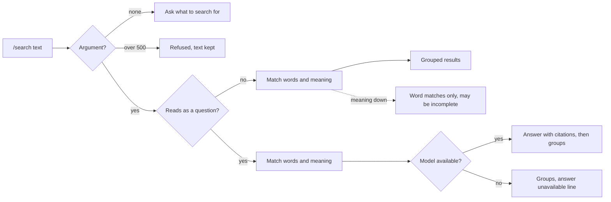

# Design — Personal Search and Context

> **Approved** by @user on 2026-09-30. Locked — changes require a change record (§7).

Context: [PRD](./01-prd.md)
Canvas: https://claude.ai/artifact/2gSaouHGa8ZjLE15L7qZqH
Exports: `./assets/canvas/`, one `.dc.html` per artboard, `canvas.json` for the
layout. Generated from 004's artboards, so every token, the rail, the capture
dock and the history panel are 001's values unchanged.

Four direction questions answered before drafting, all recommended, on
2026-09-30: desktop light and dark only, results in the capture stream,
numbered citations, related records as a section below the fields.

## 1. Design intent

Search is a read, so it looks like one: a single result card in the capture
stream, the same shape as `/memories`, grouped by record type. The written
answer sits at the top of that card, visibly separate from the records, and
every sentence carries a number that matches a row below. Nothing Slashit
says is out of reach of the record it came from. Related records are quiet:
a plain list under a record's fields, labelled as found by meaning, never
styled like a link the user made.

## 2. Screen inventory

| Screen | Purpose | Serves | Canvas artboard |
|---|---|---|---|
| Question with answer | `/search when does my passport expire?`: answer with [1] [2], then Memories, Tasks, Reminders groups, citations repeated on the rows | FR-1, FR-7, FR-9, FR-15 to FR-17 | `Main` |
| Word search | `/search passport`: groups, no answer, no citations | FR-1, FR-4, FR-7, FR-9 | `SearchPassport` |
| Meaning and overflow | `/search career`: a word match first, meaning matches after, Tasks capped at five with "See all 7 in Records" | FR-5 to FR-8 | `SearchResults` |
| No supporting record | A question nothing answers: one sentence says so, loose matches still listed | FR-18 | `SearchNoSupport` |
| Degraded | Answer unavailable, records shown. Meaning unavailable, word matches shown | FR-19, FR-20 | `SearchDegraded` |
| Search states | Loading for a word search and for a question, no argument, too long, no match, no permission, offline | FR-2, FR-3, FR-10 | `SearchStates` |
| Discovery | `/s` in the palette, `/search` first | FR-1 | `SearchDiscovery` |
| History | Search rows show the typed line and Run again, no results | FR-21 | `SearchHistory` |
| Records search | "career" in the records view, best match first, the same nine records as `/search career` | FR-22 to FR-24 | `RecordsSearch` |
| Records search states | Loading, no match, error, word matches only, filtered no match, no permission, offline | FR-20, FR-22 | `RecordsSearchStates` |
| Related on detail | A task's detail with three related records of mixed types | FR-25, FR-27 | `RelatedDetail` |
| Related states | Loading, empty, error, one match, no permission, deleted since listed | FR-12, FR-26, FR-28 | `RelatedStates` |

`Main` is the question-with-answer artboard. The canvas format requires an
entry file of that name, and the cited answer is this feature's defining
screen.

### Dark theme

`DarkMain`, `DarkSearchDegraded`, `DarkRecordsSearch`, `DarkRelatedDetail`
apply 004's dark token block exactly. The new components use existing tokens
only, so they need one dark value, listed in §6.

## 3. Flows

| Flow | Entry | Steps | Exit | Serves |
|---|---|---|---|---|
| Look up | `/search <words>` | Submit, loading card, result card | Groups, or "No records match" | FR-1 to FR-10 |
| Ask | `/search <question>` | Submit, loading card with "Reading your records to answer", result card | Answer with citations above groups, or the no-support sentence | FR-15 to FR-18 |
| Follow a citation | A [n] in the answer or on a row | Opens that record's detail | Record detail | FR-17 |
| See all | "See all n in Records" on a group | Records view, that type's tab, the search filled in | Ranked table | FR-8, FR-24 |
| Search in Records | Type in the records view search | Table re-ranks, best match first | Table, or no-match note | FR-22, FR-23 |
| Re-run | History panel, Run again | Closes the panel, runs the same line | A fresh result card | FR-21 |
| Browse related | Open any record | Fields render, Related fills below | Related list, or "Nothing related yet" | FR-25 to FR-28 |

## 4. States

### Search result card (`Main`, `SearchPassport`, `SearchResults`, `SearchStates`)

| State | What the user sees | Copy |
|---|---|---|
| Empty | No match card with a Browse Records link | "No records match “{text}”" · "Nothing you have recorded matches by word or by meaning." |
| Loading | 001's loading turn: a blue pill and skeleton lines. A question gets its own pill so the longer wait is explained | "Searching your records…" · "Reading your records to answer…" |
| Error | Model unavailable: the answer is replaced by an amber strip, records still show. Meaning unavailable: an amber strip over word matches | See §8 |
| Success | Green count pill, optional answer block, groups, footer with Open in Records | "{n} records found · 1 answer" |
| No permission | Blue note. Capture is only reachable signed in, per 002 | "Sign in to search." |
| No argument | 001's pending-question card | "What should Slashit search for?" |
| Too long | 001's red refusal note, text kept in the box | "That is {n} characters. A search can be up to 500." |
| No support | Muted pill, the answer block states nothing was found | "Nothing you have saved says {…}." |
| Offline | 001's offline refusal before anything is sent, text kept | "You are offline. Search needs a connection." |

### Records view search (`RecordsSearch`, `RecordsSearchStates`)

| State | What the user sees | Copy |
|---|---|---|
| Empty | Centred note | "No records match “{text}”" · "Clear the search to see every record." |
| Loading | 001's three skeleton rows | — |
| Error | Red note with Try again | "Search could not run. Nothing is lost." |
| Success | Ranked table, footer count, "Sorted by best match" button | "{n} records match “{text}” · best match first" |
| No permission | Blue note, session ended | "Sign in to search your records." |
| Partial | Amber strip over word matches | "Showing word matches only. Results may be incomplete." |
| Filtered, no match | Centred note naming the other matches | "No reminders match “career”" · "9 other records match." |
| Offline | Amber note. Records already on the device stay readable, per 001's FR-40 | "You are offline. Search needs a connection." |

### Related on detail (`RelatedDetail`, `RelatedStates`)

| State | What the user sees | Copy |
|---|---|---|
| Empty | Plain text under the Related label | "Nothing related yet" |
| Loading | Three skeleton rows. The fields above are already shown | — |
| Error | One line with Try again, detail unaffected | "Related records could not be loaded." |
| Success | Up to five rows: type, title, date, status | Label note: "Found by meaning · not links you made" |
| No permission | N/A. A record from another account opens as not found, per 001 | 001's not-found copy |
| Deleted since listed | Opening it shows 001's not-found page; the list drops it on next open | 001's copy |

## 5. Responsive behaviour

| Breakpoint | Layout change |
|---|---|
| Mobile | Not drawn. Deferred app-wide with 003's D-31, as 004 shipped |
| Tablet | No distinct layout. The 760px capture column and the records table flex as in 001 |
| Desktop | As drawn at 1440x900 |

## 6. Design system deltas

| Change | Kind | Token or component | Why existing one does not fit |
|---|---|---|---|
| Answer block (`.answer`, `.alabel`) | added | component | No 001 or 004 surface shows Slashit's own words beside records |
| Citation marker (`.cite`) | added | component | Numbered and paired between answer and row. `.pill` is for state, not reference |
| Result group (`.ghead`, `.gsep`, `.hit`) | added | component | 004's lookup rows hold one type. Search needs a heading and count per type |
| Card strip (`.strip.warn`, `.strip.info`) | added | component | `.note` is a standalone box. A degraded result needs a line inside the card, above what it qualifies |
| Related row (`.relrow`, `.why`) | added | component | Detail rows are label-value pairs. A related row is a record reference |
| Reminder dot (`.dot.rem`) | added to canvas | component | Already built in 003's app; 004's canvas never drew a reminder |
| Memory dot (`.dot.mem`) | changed on canvas | component | Canvas drew memory and reminder dots alike. Now matches the built app: blue, with a pale ring |
| Dark value for `.relrow` border | added | token | `#2b2724`, 004's dark row divider |
| Everything else | reused | tokens, components | 004's stylesheet, unchanged |

No one-off styles outstanding.

## 7. Accessibility

| Area | Decision |
|---|---|
| Contrast | `.cite` is `--blue` on `--blueWash`, the approved 001 pill pair. `.strip.warn` is `--amber` on `--amberWash`, as `.pill.pend` |
| Keyboard path | Tab reaches each citation, then each row, then See all, in reading order. Enter opens |
| Screen reader labels | The answer is a region labelled "Answer from your records". Each marker is announced "source {n}: {record title}". A row with a marker announces "cited as {n}" |
| Motion and reduced motion | Only 001's skeleton shimmer and spinner, already reduced-motion aware |
| Focus order | After a search, focus stays in the input, so the next search needs no click. The card is announced by a polite live region with its count |

## 8. Copy

| Location | Text | Notes |
|---|---|---|
| Palette | "/search · Search everything you have recorded" | |
| Answer label | "Answer from your records" | Always shown over the answer |
| Loading, question | "Reading your records to answer…" | Explains the longer wait of NFR-4 |
| No support | "Nothing you have saved answers “{the question as typed}”. Save it with /remember and Slashit can answer next time." | FR-18. States nothing else. Changed 2026-09-30, see change log |
| Answer unavailable | "No answer this time: Slashit's AI model is unavailable right now. Your matching records are below. This is temporary." | FR-19. Covers the model and the shared quota alike, as 001's FR-35 does |
| Meaning unavailable | "Showing word matches only. Matching by meaning is unavailable right now, so results may be incomplete." | FR-20 |
| Group overflow | "See all {n} in Records" | FR-8 |
| Card footer | "Best match first · only your records are searched" | NFR-1, said once |
| History row | "Results and answers are not kept." · "Run again" | FR-21 |
| Related label | "Found by meaning · not links you made" | Keeps 008's links distinct |
| Related empty | "Nothing related yet" · "As you record more, records close in meaning to this one appear here." | FR-26 |

## 9. Open questions

| # | Question | Owner | Answer |
|---|---|---|---|
| ~~Q1~~ | Should a result matched only by meaning say so on its row? | user | **Answered 2026-09-30.** No marker. FR-6's ranking puts word matches first |
| ~~Q2~~ | Should the answer name the record type in the sentence? | user | **Answered 2026-09-30.** No, the citation carries it |

## Change log

| Date | Change | Why | Approved by |
|---|---|---|---|
| 2026-09-30 | Created. 16 artboards across Capture, Records and Dark theme pages, generated from 004's artboards. Four direction questions answered first, all recommended | PRD approved, user asked for design | pending |
| 2026-09-30 | Q1 and Q2 answered, both as drawn. Offline states added to `SearchStates` and `RecordsSearchStates`. Canvas published | User answered the open questions | user |
| 2026-09-30 | Approved | User: "Approved, commit and push" | user |
| 2026-09-30 | No-support copy quotes the question as typed instead of rephrasing it. The `SearchNoSupport` artboard still shows the rephrased line | The server has no rephrasing, and writing one would be uncited model text, against FR-18. Dev log D-15 and Q2. No downstream doc is stale: 4.2 names the state, not its words | user |
| 2026-10-02 | `SearchDegraded` gains a limit variant: an answer refused for the daily AI allowance says "You have used today’s AI answers. Your matching records are below." instead of the unavailable line. Not drawn on the canvas | The unavailable line called a daily limit a temporary outage. Dev log Q7 | user |
