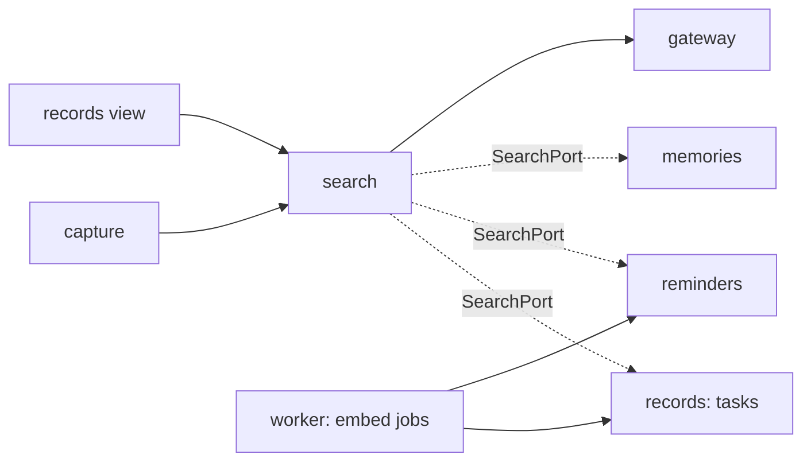

# Build Plan (HLD) — Personal Search and Context

> **Approved** by @user on 2026-09-30. Locked — changes require a change record (§7).

Context: [PRD](./01-prd.md) · [Design](./02-design.md) ·
[Tech stack](../tech-stack.md) · [004 build plan](../004-persistent-memory/03-build-plan.md)

Tables touched:

- `tasks`: changed, gains `search_vector` and `embedding`
- `reminders`: changed, gains `search_vector` and `embedding`
- `capture_turns`: changed, new outcome `searched`
- `pending_captures`: changed, `missing_field` gains `search_text`
- `events`: changed, new event types

No new table. `memories` already carries both columns (004 AD-4).

## 1. Architecture summary

A new `search` domain owns the question rule, ranking, the written answer and
related records. It holds no data. Each record domain answers a search over its
own rows through a `SearchPort`, returning candidates with a word score and a
meaning distance; search merges them into one ranked list. A search embeds the
query once, in parallel with the word query. A question then sends the top ten
records to the model, which returns sentences citing record numbers; search
drops any sentence without a valid citation. Related records reuse each
record's stored vector, so they cost no model call. Tasks and reminders gain
the columns memories already has, filled by per-domain jobs after each save.

## 2. Component map

| Component | Responsibility | Talks to | New or existing |
|---|---|---|---|
| `search` domain | Question rule, term extraction, merge and rank, answer call and citation check, related records, events | record domains' search ports, gateway | new |
| `records` domain (tasks) | Task search columns, `TaskSearchAdapter`, `records.embed_task` job, All-tab search moves to `search` | gateway | existing, extended |
| `reminders` domain | Same for reminders, `reminders.embed_reminder` | gateway | existing, extended |
| `memories` domain | `MemorySearchAdapter` over its existing `find_by_terms` and `find_nearest` | none new | existing, extended |
| `capture` domain | Parses `/search`, asks for missing text, records a `searched` turn with the typed line only | search | existing, extended |
| `gateway` domain | Unchanged. `embed` for queries and records, `extract` for the answer | none | existing |
| Worker | Two new embed jobs, the backfill job extended to tasks and reminders | database, gateway | existing |
| Frontend | Search result card, records view search, related section, history Run again | GraphQL | existing, extended |



The graph stays acyclic. Search declares the port; each record domain
implements it in an adapter wired in `core/deps.py`, the inversion 003 and 004
already use. Search never imports a record domain's models.

## 3. Data model

| Entity | Key fields | Owns | Lifecycle | Tenancy scope |
|---|---|---|---|---|
| `tasks` | adds `search_vector tsvector` generated from `title`, `english`; `embedding vector(768)` nullable | nothing | `embedding` set NULL on title edit, refilled by `records.embed_task`. Soft delete keeps both, and every search skips `deleted_at` rows | `user_id` |
| `reminders` | the same, from `description` | nothing | the same, via `reminders.embed_reminder` | `user_id` |
| `memories` | unchanged: `search_vector`, `embedding` | | A forgotten memory is deleted outright (004), so its search data goes with it | `user_id` |
| `capture_turns` | outcome adds `searched`. `input_text` is the typed line; no result and no answer is stored (FR-21) | | append-only | `user_id` |
| `pending_captures` | `missing_field` adds `search_text` for FR-2 | | deleted on answer, as today | `user_id` |
| `events` | adds `search_run`, `search_result_opened`, `answer_citation_opened`, `related_opened`. Counts, types, positions; never text (T6) | | insert-only | `user_id` |

GIN index on each new `search_vector`. No vector index, per AD-9.

Migrations required: yes. `0032_task_search`, `0033_reminder_search`,
`0034_search_capture` (turn outcome, pending field) and `0035_search_events`.
RLS is already forced on every table touched (T2); no policy changes.

## 4. API surface

GraphQL, one endpoint (T1), one graph (AD-8). Every field is
`IsAuthenticated`, and every read runs in the user's RLS transaction.

| Operation | Kind | Input | Output | Serves |
|---|---|---|---|---|
| `submitCapture` | mutation, existing | text | union adds `SearchResults`: groups of `SearchHit` (a `Task`, `Reminder` or `Memory`, with `citation`), per-type totals, optional `answer` (sentences with citation numbers), `noSupport`, `answerUnavailable`, `meaningUnavailable`. Adds `SearchTooLong` | FR-1 to FR-21 |
| `answerPendingCapture` | mutation, existing | the missing search text | as `submitCapture` | FR-2 |
| `search` | query | text, optional type, `offset`, `limit` (max 50) | `SearchPage`: ranked hits, `total`, `meaningUnavailable`. Never an answer | FR-22 to FR-24 |
| `relatedRecords` | query | record id and type | up to five hits | FR-25 to FR-28 |
| `captureHistory` | query, existing | | a `searched` turn carries its line; Run again resubmits it from the client | FR-21 |

`relatedRecords` is its own query so a slow or failed list never holds up the
detail (FR-28). The records view's existing `records(filter.search)` argument is
retired; the view calls `search` whenever a search term is present.

## 5. Model and vendor choices

| Use | Choice | Why | Fallback | Est. cost per call | Latency budget |
|---|---|---|---|---|---|
| Query meaning | `gemini-embedding-001` through `gateway.embed`, 768 dimensions | The vectors already stored for memories; one space for all types | Timeout at 2.5 s, then word matches only with FR-20's line | under 0.000001 USD, about 10 tokens, `estimate` | 2.5 s. Measured 2.5 s live once (004 T-1.1) |
| Record meaning | The same, from each record's title or description, in a job after commit | Keeps capture's own latency unchanged | Job retries three times; the backfill job catches the rest | under 0.00001 USD, `estimate` | off the request path |
| Written answer | `gemini-3.6-flash`, reasoning "low", through `gateway.extract` with a fixed schema | The model every other call uses; "low" held 004's quality bars (004 D-22) | Any gateway error returns records with `answerUnavailable` (FR-19) | about 0.00014 USD: 800 in at 0.10, 150 out at 0.40 USD per million, `estimate` from tech stack §5 | 5 s, inside NFR-4's 8 s. 004 measured 3.8 s median at "low" |
| Related records | No model. Cosine distance over stored vectors | A detail view must not cost a call | Record with no vector yet shows "Nothing related yet" | none | 1 s, NFR-5 |

Answer schema, as sent to `extract`:

```json
{"sentences": [{"text": "string", "sources": [1, 2]}], "supported": true}
```

Records reach the prompt numbered 1 to 10, with type, text, date and status,
never an id. The model never sees another user's data: the ten come from the
user's own RLS-scoped search.

## 6. Cross-cutting concerns

| Concern | Decision |
|---|---|
| Auth | `IsAuthenticated` on every field. Unauthenticated gets 002's session-ended path |
| Tenancy and isolation | Every search port runs inside `user_transaction` under RLS. The backfill job is the only cross-user reader, on the service-role connection (T3), writing one vector column per row and attributing each embed call to the row's owner (T9). T7 tests: user A's `search`, `/search`, answer prompt and `relatedRecords` never contain user B's record, even with B's id supplied |
| Limits | Input 500 characters (FR-3). Answer calls count against the per-user cap; embed calls are attributed but uncounted (T9). A capped user still gets records, with FR-19's line |
| Cost | Per question about 0.00014 USD; per lookup negligible. A user asking 50 questions a month costs under 0.01 USD, `estimate`. The backfill costs under 0.03 USD for 3,000 records, `estimate` |
| Observability | Events hold counts, types and positions only. Search and answer calls are not traced, and the structlog processor from 004 AD-9 is extended to strip `query`, `sentences` and record text fields (AD-10). Latency logged per stage: words, meaning, answer |
| Failure and retry | The meaning call and the answer call each fail independently to their FR-20 and FR-19 states. Nothing a search does writes a record, so a retry is always safe. Embed jobs retry three times, then leave NULL for the periodic backfill |

## 7. Alternatives considered

| Area | Chosen | Alternatives | Why the alternative lost | Cost delta |
|---|---|---|---|---|
| Where search data lives | Columns on each record table | One shared search index table | Duplicates record text, and cannot hold a foreign key to three tables, so forget and delete must clean it by code. 004's forget guarantee would stop being a database fact. Chosen by the user 2026-09-30 | none |
| Lookup latency | 3 s, one response | Words in 1 s, meaning after; cached query vectors | Two steps needs a design change and a second request; caching still fails every first search. Chosen by the user 2026-09-30 | none |
| Schema shape | One graph | Split by domain, stitched | A stitching layer for a one-person product. Closes tech stack T-Q7. Chosen by the user 2026-09-30 | none |
| Answer input | Top 10 records | Top 5; top 20 | 5 misses broad questions; 20 doubles cost and pushes NFR-4. Chosen by the user 2026-09-30 | baseline |
| Citation check | Server drops uncited sentences | Trust the model's citations | NFR-8 demands zero uncited sentences; a model will sometimes omit one | none |
| Vector index | Exact scan per user | HNSW index | A user holds thousands of rows, not millions. A global ANN index filtered by user loses recall for no speed gain at this size | none |
| Record embedding | Job after commit | Inline in the save | Adds up to 2.5 s to every capture and edit, against 001's 8 s budget | none |

## 8. Architecture decisions

| # | Decision | Status | Graduates to tech-stack.md or product.md? |
|---|---|---|---|
| AD-1 | A `search` domain with no tables orchestrates; each record domain answers search over its own rows through a `SearchPort` | locked | yes, tech stack §3: every record type implements `SearchPort` from its first build |
| AD-2 | Search columns live on each record's table: a generated `search_vector` and a nullable `embedding vector(768)` | locked | yes, with AD-1 |
| AD-3 | Ranking tiers: every term present, then some term present, then meaning only under `MEANING_MAX_DISTANCE` (0.35, `estimate`, tuned on the NFR-7 set). Word tiers order by text rank, the meaning tier by distance | locked | no |
| AD-4 | The query is embedded in parallel with the word query, with a 2.5 s budget. On timeout or error, word matches return with `meaningUnavailable` | locked | no |
| AD-5 | The answer takes the top ten merged hits, numbered. Sentences with no or out-of-range sources are dropped, at most four are kept, and no sentence left means `noSupport`. Cited records are pinned into their group's first five, so FR-17 holds | locked | no |
| AD-6 | Related records use the record's stored vector, nearest five across types under `RELATED_MAX_DISTANCE` (0.30, `estimate`), excluding itself. No model call | locked | no |
| AD-7 | Tasks and reminders are embedded by per-domain jobs after commit. An edit sets `embedding` NULL first, so the old meaning never matches (FR-14). 004's periodic backfill covers all three types; a one-off run at deploy fills rows created before 005 (FR-13) | locked | no |
| AD-8 | The GraphQL schema stays one graph. Closes T-Q7 | locked | yes, tech stack §6 |
| AD-9 | No vector index in V1. Revisit when a single user passes 20,000 records, `estimate` | locked | no |
| AD-10 | Search queries, answer sentences and record text never reach logs, events, usage rows or tracing. Extends T6 from memory text to all record text | locked | yes, tech stack T6 |
| AD-11 | A test enumerates the record types and fails when one has no registered `SearchPort` (FR-11) | locked | no |

## 9. Questions for the user

| # | Question | Options | Recommended | Answer |
|---|---|---|---|---|
| ~~Q1~~ | NFR-3's 1 s against a 2.5 s meaning call | Relax to 3 s; words then meaning; cache query vectors | Relax to 3 s | **Relax to 3 s.** 2026-09-30, PRD change record the same day |
| ~~Q2~~ | Where search data lives | Each record's table; one shared index | Each table | **Each table.** 2026-09-30 |
| ~~Q3~~ | T-Q7: one graph or split | One graph; split by domain | One graph | **One graph.** 2026-09-30 |
| ~~Q4~~ | Records sent to the answer | 10; 20; 5 | 10 | **10.** 2026-09-30 |
| ~~Q5~~ | How long a search waits for the meaning call before falling back to words only | 2.5 s; 3.0 s; 1.5 s | 2.5 s | **2.5 s.** 2026-09-30. AD-4 |
| ~~Q6~~ | Is the NFR-4 risk acceptable at about 7 s median? | Accept and re-measure after deploy; five records; raise NFR-4 to 12 s | Accept and re-measure | **Accept, re-measure after deploy with epic 012.** 2026-09-30 |

## 10. Risks

| Risk | Likelihood | Impact | Mitigation | Owner |
|---|---|---|---|---|
| NFR-4 fails: embed plus answer exceed 8 s at p95 | high | medium | Accepted per Q6: stage timings logged, re-measured from the deployed API with epic 012, and brought back to the user if it still fails | Claude, with epic 012 |
| NFR-3 fails from a distant host, as 004's NFR-5 did at 1.7 s | medium | medium | Re-measured from the deployed API, per the PRD change | Claude, with epic 012 |
| Distance thresholds are wrong: meaning matches noisy or missing | medium | medium | AD-3 and AD-6 thresholds tuned on the NFR-7 and NFR-9 sets before implementation plan approval | Claude |
| The model cites the wrong record for a true sentence | medium | high | AD-5 checks presence, not truth. NFR-8's hand-judged set measures truth | Claude |
| The backfill hits the provider's rate limit at deploy | low | low | Throttled to 5 calls a second, `estimate`; the periodic job finishes what is left | Claude |
| A later record type ships without a search port | medium | medium | AD-11's test, and AD-1 graduated to the tech stack | Claude |
| An exact scan grows slow for a heavy user | low | medium | AD-9's threshold; stage timings show it first | Claude |

## Change log

| Date | Change | Why | Approved by |
|---|---|---|---|
| 2026-09-30 | Created. Q1 to Q4 answered before drafting, all recommended; NFR-3 relaxed in the PRD the same day | Design approved, user asked for the build plan | pending |
| 2026-09-30 | Q5 and Q6 answered, both recommended | User answered the open questions | user |
| 2026-09-30 | Approved. AD-1, AD-2, AD-8 and AD-10 graduated to the tech stack in the same commit | User: "Approved, commit and push" | user |
