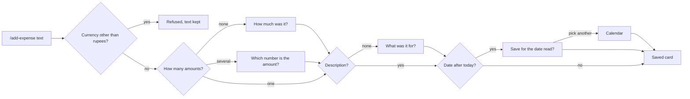

# Design — Expenses

> **Approved** by @user on 2026-10-02. Locked — changes require a change record (§7).

Context: [PRD](./01-prd.md)
Canvas: https://claude.ai/artifact/P9UBnLYghEdQ8nWijWKQE5
Exports: `./assets/canvas/`, one `.dc.html` per artboard, `canvas.json` for the
layout. Generated from 005's stylesheet and 004's shell, so every token, the
rail, the capture dock and the records table are unchanged. Weekday names on
every artboard checked against the 2026 calendar, today being Fri 2 Oct.

About fifteen lines over the 200-line budget: four surfaces each carry a full state
table.

Four direction questions answered before drafting, all recommended, on
2026-10-02: desktop light and dark only, a summary band above the Expenses
table, summary rows with share bars, one chip per number when asking for the
amount.

## 1. Design intent

An expense is a number first. The amount always sits in mono, aligned right,
and it is the first field on every card and the headline of the detail page.
After each save, Slashit shows the amount, description, category and date it
read, so a misread number is caught where it was typed. Totals look the same
everywhere: the same category order, largest first, and the same green share
bar in the capture card and in the Records band. The bars are proportions, not
a chart, and nothing invites budgeting.

## 2. Screen inventory

| Screen | Purpose | Serves | Canvas artboard |
|---|---|---|---|
| Expense saved | `/add-expense ₹850 dinner with friends yesterday`: card with Amount, Description, Category, Date | FR-1, FR-2, FR-7, FR-9, FR-11, FR-12 | `Main` |
| Questions | Missing amount, missing description, a future date to confirm: "Yes, Sat 10 Oct" or Pick another date | FR-3, FR-4, FR-8, FR-15 | `ExpenseAsk` |
| Date pick | Pick another date opens a calendar inside the card, today ringed, the chosen day filled, "Save for {date}" | FR-8 | `DatePick` |
| Amount pick | "2 coffees 180": one chip per number, then the saved card | FR-5 | `AmountPick` |
| Capture refusals | Another currency, description over 200, model unavailable | FR-6, FR-13, FR-14 | `CaptureStates` |
| Capture states | Loading for a save and a summary, offline, no permission | FR-1, FR-23 | `CaptureMoreStates` |
| Summary | `/expenses last month`: category rows with share bars, total, Open in Records | FR-23, FR-25 | `Summary` |
| Summary states | No period shows this month, nothing in the period, period not understood | FR-24, FR-26, FR-27 | `SummaryStates` |
| Discovery | `/ex` in the palette lists `/add-expense` and `/expenses` | FR-1 | `ExpenseDiscovery` |
| Search by amount | `/search 850`: an Expenses group with two exact matches, then a task | FR-29, FR-30 | `SearchExpense` |
| Expenses view | Period picker, category chips, summary band, table of date, description, category, amount | FR-16 to FR-18, FR-28 | `RecordsExpenses` |
| Expenses view states | Empty, loading, error, empty period, filtered, no permission, offline, deleted | FR-16, FR-17 | `ExpensesStates` |
| All records | An expense shows its amount in the status column | FR-19 | `RecordsAll` |
| Detail | Amount as headline, description, category, date, saved, last edited, origin, what was typed | FR-20 | `ExpenseDetail` |
| Edit | Amount, description with counter, category as eight segments, date | FR-21 | `ExpenseEdit` |
| Detail states | Loading, invalid amount, description too long, saving, save failed, delete failed, not found | FR-21, FR-22 | `DetailStates` |
| Delete | Confirmation naming amount and description | FR-22 | `DeleteExpense` |

### Dark theme

`DarkMain`, `DarkSummary`, `DarkRecordsExpenses`, `DarkExpenseDetail` apply
005's dark token block exactly. The new components need one dark value, listed
in §6.

## 3. Flows

| Flow | Entry | Steps | Exit | Serves |
|---|---|---|---|---|
| Record | `/add-expense <text>` | Submit, loading turn, saved card | Card with the four fields, Edit, Open in Records | FR-1 to FR-12 |
| Answer a question | A question card | Type or pick a chip | Saved card under the answer | FR-3 to FR-5, FR-15 |
| Confirm a future date | Date question | "Yes, {date}", or Pick another date, choose a day, Save for {date} | Saved card with the chosen date | FR-8 |
| Summarise | `/expenses [period]` | Submit, loading turn, summary card | Rows and total, or the empty-period card | FR-23 to FR-27 |
| Open totals in Records | Open in Records on a summary | Expenses tab, the same period picked | Band and table | FR-18, FR-28 |
| Browse | Records, Expenses tab | Pick a period, a category, or search | Band and table update together | FR-16 to FR-18 |
| Fix | Detail, Edit | Change fields, Save changes | Detail with Last edited set, totals updated | FR-21 |
| Remove | Detail, Delete | Confirm | Expenses view, deleted note | FR-22 |

## 4. States

### Capture card (`Main`, `ExpenseAsk`, `AmountPick`, `CaptureStates`, `CaptureMoreStates`)

| State | What the user sees | Copy |
|---|---|---|
| Empty | N/A. A capture turn exists only once something is typed | — |
| Loading | 001's loading turn, a blue pill and two skeleton lines | "Reading your expense…" |
| Error | Red note for another currency or an over-long description. Amber note when the model is down. Text kept in the box | See §8 |
| Success | Green "Expense saved" pill, four fields, Edit and Open in Records | "Saved just now · via command" |
| No permission | Blue note | "Sign in to record expenses." |
| Question | 001's pending-question card, blue head | See §8 |
| Offline | Amber note before anything is sent | "You are offline." |

### Summary card (`Summary`, `SummaryStates`, `CaptureMoreStates`)

| State | What the user sees | Copy |
|---|---|---|
| Empty | Muted pill naming the period, the date range below | "No expenses recorded last week" |
| Loading | 001's loading turn | "Adding up your expenses…" |
| Error | Red note listing accepted periods. Offline as above | See §8 |
| Success | Period pill, count, category rows with share bars, Total row | "Largest first · only your expenses are counted" |
| No permission | As the capture card | — |

### Expenses view (`RecordsExpenses`, `ExpensesStates`)

| State | What the user sees | Copy |
|---|---|---|
| Empty | Centred note with an example command | "No expenses yet" |
| Loading | 001's three skeleton rows. The band shows once totals arrive | — |
| Error | Red note with Try again | "Your expenses could not be loaded." |
| Success | Band with total and up to eight category cells, then the table | "{n} expenses · newest first" |
| No permission | Blue note | "Sign in to see your expenses." |
| Empty period | Centred note, band hidden | "No expenses recorded in {month}" |
| Filtered, no match | Centred note | "No {category} expenses in {period}" |
| Offline | Amber note. Loaded rows stay readable, per 001's FR-40 | "You are offline." |

### Detail, edit and delete (`ExpenseDetail`, `ExpenseEdit`, `DetailStates`, `DeleteExpense`)

| State | What the user sees | Copy |
|---|---|---|
| Empty | N/A. A detail always has a record | — |
| Loading | Skeleton for the amount and fields | — |
| Error | Field errors in red under the field. Save or delete failure as a red note with Try again | See §8 |
| Success | Detail with Last edited updated. After delete, the Expenses view with a green note | "Expense deleted. It no longer counts in any total." |
| No permission | A record from another account opens as not found, per 001 | 001's copy |
| Not found | Centred note with Back to Expenses | "This expense no longer exists" |
| Saving | Primary button dimmed with a spinner | "Saving…" |

## 5. Responsive behaviour

| Breakpoint | Layout change |
|---|---|
| Mobile | Not drawn. Deferred app-wide with 003's D-31 |
| Tablet | No distinct layout. The 760px capture column and the table flex as in 001. The band wraps to two rows of four |
| Desktop | As drawn at 1440x900 |

## 6. Design system deltas

| Change | Kind | Token or component | Why existing one does not fit |
|---|---|---|---|
| Expense marker (`.dot.exp`) | added | component | Each type has its own marker. A ₹ glyph in the success green, 12 px, distinct from 007's event diamond and the task square and reminder and memory circles. Changed from a green diamond on 2026-10-03, see the change log |
| Amount (`.amt`, `.num`) | added | component | Mono, tabular figures, right aligned. Prose text cannot align a column of amounts |
| Summary rows (`.sum`, `.sumrow`, `.sumtotal`) | added | component | 004's lookup rows hold text, not a value and a proportion |
| Share bar (`.bar`) | added | component | No existing element shows a proportion |
| Summary band (`.band`, `.tot`, `.bc`) | added | component | The records view has no place for totals above a table |
| Period picker (`.select`) | added | component | Tabs and chips choose among few options. Periods include any named month |
| Amount chips (`.choicechip`) | added | component | 003's chips are small buttons. An amount choice needs mono and a selected state |
| Calendar (`.cal`, `.calgrid`) | added | component | No date picker exists in 001 to 005. Weeks start Monday, per the PRD's assumption. Reused by the Edit date field |
| Dark value for selected calendar day text | added | token | `#1c1917` on `--blue`, as `.btn.pri` in dark |
| Dark value for `.bar` track | added | token | `#2b2724`, 004's dark row divider |
| Everything else | reused | tokens, components | 005's stylesheet, unchanged |

No one-off styles outstanding.

## 7. Accessibility

| Area | Decision |
|---|---|
| Contrast | Bars are `--green` on `--rail`, decorative. Every bar sits beside its amount in text, so no value depends on the bar |
| Keyboard path | Amount chips are buttons in reading order, Enter picks. The calendar is a grid: arrow keys move by day, Page Up and Page Down by month, Enter chooses. In the view: period picker, category chips, search, then table rows |
| Screen reader labels | Amounts are read as "850 rupees", not "rupee sign 850". Each bar is hidden from screen readers. The summary is a table with category and amount columns |
| Motion and reduced motion | Only 001's skeleton shimmer and spinner, already reduced-motion aware |
| Focus order | After a save, focus stays in the input. A question card takes focus on its first chip or field |

## 8. Copy

| Location | Text | Notes |
|---|---|---|
| Palette | "/add-expense · Record an expense" · "/expenses · Totals by category for a period" | |
| No amount | "How much was it?" · "Reply with the amount in rupees. Nothing is saved until you answer." | FR-3 |
| No description | "What was the expense for?" | FR-4, source §35 |
| Two numbers | "Which number is the amount?" · "Your text has two numbers. Nothing is saved until you pick one." | FR-5 |
| Future date | "{Phrase} reads as {date}, which is after today. Save it for that date?" · "Confirm the date Slashit read, or pick another. Nothing is saved until you choose." · "Yes, {date}" · "Pick another date" | FR-8 |
| Date pick | "Chosen date" · "Any date works, past or future. Today is ringed." · "Save for {date}" · "Back" | FR-8 |
| Other currency | "Slashit records rupees only for now. Enter the amount in ₹ and it will save. Your text is still in the box." | FR-6 |
| Too long | "That description is {n} characters. It can be up to 200." | FR-13 |
| Model down | "Slashit could not save this right now. Its AI model is unavailable. This is temporary. Your text is still in the box." | FR-14 |
| Period not read | "Slashit did not understand “{text}”. Try today, this week, last week, this month, last month, a month such as august, or this year." | FR-27 |
| Empty period | "No expenses recorded {period}" · "{range}. Record one with /add-expense." | FR-26 |
| Summary footer | "Largest first · only your expenses are counted" | NFR-1 said once |
| Search footer | "A number also matches expenses of exactly that amount" | FR-30 |
| Delete | "Delete this expense?" · "{₹ amount} · {description} will be removed from your records and from every total." | FR-22 |

## 9. Open questions

None. The four direction questions were answered before drafting.

## Change log

| Date | Change | Why | Approved by |
|---|---|---|---|
| 2026-10-02 | Created. 21 artboards across Capture, Records and Dark theme pages, generated from 005's stylesheet. Four direction questions answered first, all recommended. Canvas published | PRD approved, user asked to proceed | pending |
| 2026-10-02 | Future date now confirmed or replaced from a calendar: `ExpenseAsk` redrawn, `DatePick` added, `DetailStates` drops the future-date error for a too-long description. Weekday names corrected on every artboard. Calendar added as a delta | User asked for the resolved date to be confirmed, with a custom date picker | user |
| 2026-10-02 | Approved | User: "fine, proceed with next" | user |
| 2026-10-03 | Expense marker: green diamond replaced by a ₹ glyph, since 007's event marker is also a green diamond and the two met in the All tab. New copy for FR-2's ceiling: "That amount is too large to save. Check it for an extra zero.", on the capture refusal note and the edit form's amount error, in the existing refusal and field-error styles. Canvas artboards not redrawn; the marker and copy are code-level deltas | Merge of 006 and 007 on `main`; PRD FR-2 change. Decisions 1A and 3A | user, 2026-10-03: "go with your recommendation" |
