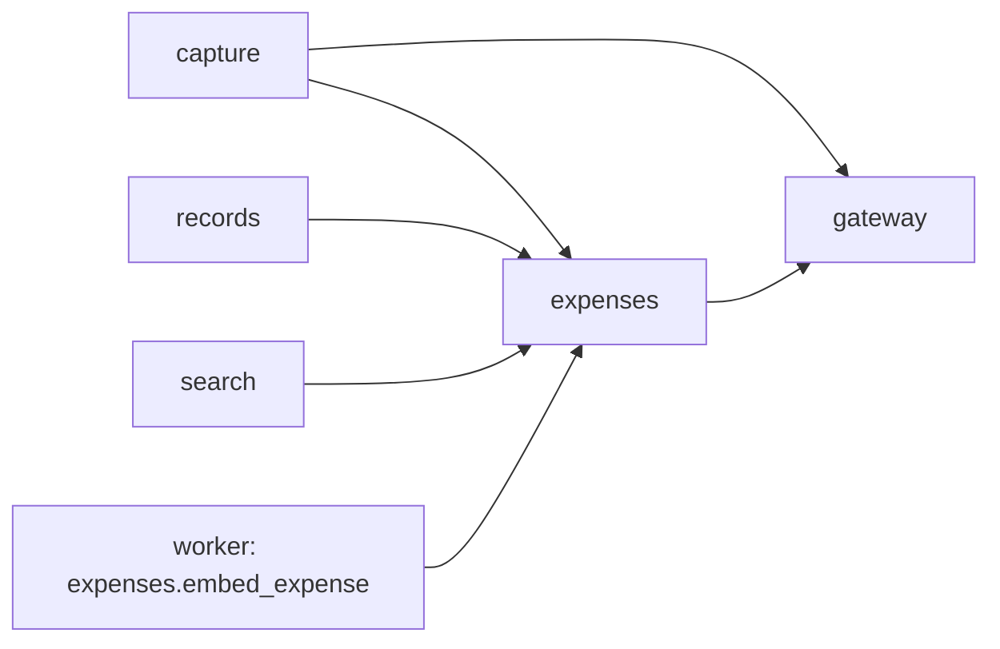

# Build Plan (HLD) — Expenses

> **Approved** by @user on 2026-10-02. Locked — changes require a change record (§7).

Context: [PRD](./01-prd.md) · [Design](./02-design.md) ·
[Tech stack](../tech-stack.md) ·
[004 build plan](../004-persistent-memory/03-build-plan.md) ·
[005 build plan](../005-personal-search-and-context/03-build-plan.md)

A few lines over the 250-line budget: §5 carries the capture decision table.

Tables touched:

- `expenses`: new
- `pending_captures`: changed, gains four `expense_` columns, an `amount_candidates` array and four question kinds
- `capture_turns`: changed, gains `resulting_expense_id` and two outcomes
- `events`: changed, new event types

> Migrations are numbered after 007's `0038_capture_events` (renumbered
> 2026-10-03, see the change log; first planned after 005's `0036_event_properties`). 005 is on `main`
> with live runs still owed. 006 touches the same capture, records and search
> wiring files, so it branches from `main` after 005's open fixes land there.

## 1. Architecture summary

A new `expenses` domain owns the record, its eight categories, the period
parser and the totals. Capture parses `/add-expense` the way it parses
`/remind`. One structured model call returns every candidate amount, the
currency, the description, the category and the date. Code then checks the
candidates against the typed text and decides whether to save or ask. An
unanswered question waits in capture's `pending_captures`, with the draft held
in typed columns. `/expenses` and the Records view both send a date range to
one summary method in expenses, which sums integer paise in SQL, so the two
paths cannot disagree. Search reaches expenses through a new `SearchPort`
adapter, by words, by meaning and by exact amount.

## 2. Component map

| Component | Responsibility | Talks to | New or existing |
|---|---|---|---|
| `expenses` domain | Expense CRUD, soft delete, summary by period, period parser, amount normaliser, search candidates, embed job | gateway, through an embed adapter | new |
| `capture` domain | Parses `/add-expense` and `/expenses`, runs the extraction, checks candidates and currency, asks and stores the four questions, records turns | expenses, gateway | existing, extended |
| `records` domain | Adds expenses to the All tab, showing the amount as the status | expenses | existing, extended |
| `search` domain | Adds an expense `SearchPort` adapter. The every-type test then covers it | expenses | existing, extended |
| `gateway` domain | Unchanged. `extract` and `embed` serve as for 004 and 005 | none | existing |
| `analytics` domain | New event types, ids and numbers only | none | existing, extended |
| Worker process | `expenses.embed_expense` after a create or a description edit | database, gateway | existing, from 003 |
| Frontend | Saved card, four question cards, calendar, summary card, Expenses tab with band, detail, edit, delete | GraphQL | existing, extended |



The graph stays acyclic. Expenses imports nothing from capture, records or
search; each reaches it through its own port, per repo rules §6.

## 3. Data model

| Entity | Key fields | Owns | Lifecycle | Tenancy scope |
|---|---|---|---|---|
| `expenses` | `id`, `user_id`, `amount_paise bigint` (> 0), `description text` (1 to 200 characters), `category expense_category` (food, transport, shopping, bills, health, entertainment, travel, other), `spent_on date`, `origin` (command), `original_input`, `embedding vector(768)` nullable, `search_vector tsvector` generated from description and category, `created_at`, `updated_at`, `deleted_at` | nothing | Soft-deleted: `deleted_at` stamped, row kept, every read skips it (`product.md` §4) | `user_id` |
| `pending_captures` | `missing_field` adds `expense_amount`, `expense_description`, `expense_amount_choice`, `expense_date`. Adds `expense_amount_paise`, `expense_description`, `expense_category`, `expense_spent_on`, `amount_candidates bigint[]` | | Deleted on answer or discard, as today | `user_id` |
| `capture_turns` | adds `resulting_expense_id`. Outcomes add `expense_saved`, `expenses_summarised` | | Append-only, as today | `user_id` |
| `events` | `event_type` adds `expense_saved`, `expense_summary_viewed`, `expense_amount_asked`, `expense_currency_refused`, `expense_amount_edited`, `expense_category_edited`, `expense_deleted` | | Insert-only, numbers and booleans only (005 AD-10) | `user_id` |

`spent_on` is a calendar date in the user's zone, never a timestamp. "Yesterday"
at 11 pm in Pune and the October total both read the same day. A partial index
on `(user_id, spent_on DESC) WHERE deleted_at IS NULL` serves the list and the
summary. A GIN index serves `search_vector`, as on `reminders`.

```sql
CHECK (amount_paise > 0)
CHECK (char_length(description) BETWEEN 1 AND 200)
```

Migrations required: yes. `0039_expenses` creates the table, the enum, both
checks, the indexes, forced RLS, its policy and the `authenticated` grant (T2).
`0040_capture_expense` changes `pending_captures` and `capture_turns`.
`0041_expense_events` adds the event types.

## 4. API surface

GraphQL, one endpoint (T1). Every field is `IsAuthenticated`. Interactors load
by `(id, user_id)` with `deleted_at IS NULL`, so another user's id and a deleted
id both read as not found.

| Operation | Kind | Input | Output | Serves |
|---|---|---|---|---|
| `submitCapture` | mutation, existing | text | union adds `ExpenseSaved`, `ExpenseQuestionAsked` (kind, candidates, read date), `ExpenseSummary`, `ExpenseRefused` (other currency, too long, period not understood). Gateway failures pass through unmapped, as today | FR-1 to FR-15, FR-23 to FR-27 |
| `answerPendingCapture` | mutation, existing | answer text. A chip sends the chosen amount; the calendar and "Yes" send an ISO date | `ExpenseSaved`, a further `ExpenseQuestionAsked`, or `PendingCaptureNotFound` | FR-3 to FR-5, FR-8, FR-15 |
| `expenses` | query | period range, category, search | list, newest `spent_on` first | FR-16, FR-17 |
| `expenseSummary` | query | period range, category | per-category totals, grand total, count | FR-18, FR-28 |
| `expense` | query | id | `Expense` or `ExpenseNotFound` | FR-20 |
| `updateExpense` | mutation | id, amount, description, category, date | `Expense`, `ExpenseNotFound`, `ExpenseInvalid` (field and reason) | FR-21 |
| `deleteExpense` | mutation | id | `ExpenseDeleted` or `ExpenseNotFound` | FR-22 |
| `records` | query, existing | | All tab gains expenses through records' port | FR-19 |
| `search` | query, existing | | union gains `Expense` | FR-29, FR-30 |

The Records period picker sends the same `{start, end}` range the parser
produces for a typed period, so FR-28 holds by construction.

## 5. Model and vendor choices

| Use | Choice | Why | Fallback | Est. cost per call | Latency budget |
|---|---|---|---|---|---|
| Expense extraction | `gemini-3.6-flash` through `gateway.extract`, structured output `{amounts[], currency, description, category, local_date}`, with the user's local today and zone in the instruction | Already the capture path. One call reads everything, category included | Any gateway failure refuses, text kept (FR-14) | about 0.00005 USD, from about 400 tokens in and 50 out at the tech stack's prices, `estimate` | 8 s p95 (NFR-2), measured 5.3 to 8.5 s in 001 |
| Category for a description given later | Same call, on the answer to "What was it for?" | The first call had no description to classify | Saves as Other, per FR-10, rather than refusing a capture already half-answered | as above | as above |
| Meaning vector | `gemini-embedding-001` through `gateway.embed`, in the worker after commit | 005 AD-2. Lets "food" find "dinner at Toit" | Job retries three times, then leaves NULL. A NULL vector is matched by words only | under 0.00001 USD, `estimate` | off the request path |
| Amount check | Code, no model | NFR-5. A model-listed amount is kept only if the same number appears in the typed text after normalising `k`, commas and Indian grouping | None needed | none | under 1 ms |
| Currency check | Code first, model second | `$`, `€`, `£`, `USD`, `EUR`, `GBP`, `AED`, `SGD` and similar tokens refuse without a model call. A model `currency` other than INR refuses too | None needed | none | under 1 ms |
| Period parsing | Code, a closed list | FR-23's list is closed, so rules are exact, free and instant | None needed | none | under 1 ms |
| Summary | One `SUM ... GROUP BY category` in PostgreSQL over integer paise | NFR-6: exact to the paisa | None needed | none | NFR-3, under 1 s at 5,000 expenses |

How a capture resolves, after the one extraction call:

| Candidates kept | Currency | Description | Date | Result |
|---|---|---|---|---|
| any | not INR | any | any | Refused, FR-6 |
| none | INR | any | any | Ask "How much was it?", FR-3 |
| two or more | INR | any | any | Ask which, chips, FR-5 |
| one | INR | empty | any | Ask "What was it for?", FR-4 |
| one | INR | present | after today | Ask to confirm the read date, FR-8 |
| one | INR | present | today or earlier | Saved |

Questions chain in that order, one at a time. Each answer is stored on the same
pending row and the table above is re-run on the draft.

## 6. Cross-cutting concerns

| Concern | Decision |
|---|---|
| Authentication | Existing Supabase JWT, unchanged |
| Authorisation | Interactors load by `(id, user_id)` with `deleted_at IS NULL`. Another user's id returns `ExpenseNotFound` |
| Tenant isolation | RLS forced on `expenses` (T2). The summary and the search query run on the request's `authenticated` connection, so a total can only sum the caller's rows (NFR-1). Boundary tests: user A reading, editing, deleting, searching or summing user B's expense gets nothing or zero (T7) |
| Rate limits and quotas | A capture costs one `generate` against the per-user cap, today 20 a day (004 build plan §6). A capture asking "What was it for?" costs a second. Summaries, lists and edits cost none. Embeds are attributed and uncounted (T9) |
| Cost controls | No model call for summaries, periods, the amount check or the currency check. One embed per create or description edit |
| Caching | None. MobX stores hold server state, per the tech stack. A save, edit or delete refetches the open summary |
| Observability | `description` is already a redacted log key (005 AD-10). `amount` and `amount_paise` join the list, since a spend amount is personal data. Events carry ids, counts and booleans only. Save latency is logged per call for NFR-2 |
| Failure and retry | A save is one transaction: expense insert and turn. Answering a question is one transaction: delete the pending row, insert the expense, record the turn. The embed job retries three times |
| Data retention and privacy | Soft delete, as every record type except memories. Description and amount never reach `ai_usage` or `events` (T6). If Langfuse is deployed, expense calls are traced without content, as memory calls are |

## 7. Alternatives considered

| Decision | Chosen | Alternatives | Why they lost | Reversibility |
|---|---|---|---|---|
| Money type | `bigint` paise | `numeric(12,2)`; float | Float loses paise in sums. `numeric` is exact too, but every layer then needs a decimal type; integer paise is exact with plain ints | costly once data exists |
| Amount reading | Model lists candidates, code checks them | Rules only; model only | Rules ask needlessly on "850 on 28 sep"; model-only lets a made-up number into totals. Chosen by the user 2026-10-02 | cheap |
| Periods | Code parser | Model call | A model call per summary costs quota and can read periods FR-23 excludes. Chosen by the user 2026-10-02 | cheap |
| Pending draft | Typed `expense_` columns | One JSON draft column | The database cannot check JSON. Chosen by the user 2026-10-02 | cheap |
| Embeddings | Yes, per 005 AD-2 | Words and amounts only | Breaks the inherited search rule and needs an exception. Chosen by the user 2026-10-02 | cheap |
| Where extraction runs | Capture, as for reminders | Expenses calls the gateway itself, as memories does | Memories needed its own rows to judge conflicts. Expenses needs nothing of its own to read a sentence | cheap |
| `spent_on` | `date` | `timestamptz` | Nothing records the time of a spend, and a timestamp shifts across midnight between zones | costly once data exists |

## 8. Architecture decisions to lock

| # | Decision | Status | Graduates to tech-stack.md or product.md |
|---|---|---|---|
| AD-1 | New `expenses` domain, per 003 AD-1 | locked | no, 003 already graduates it |
| AD-2 | Money is stored and summed as `bigint` paise. No float or decimal crosses any layer; the GraphQL type carries paise and the client formats rupees | locked | yes, tech stack §4: how money is stored |
| AD-3 | `spent_on` is a local `date`. Periods resolve in the user's zone through capture's `LocalClockPort` and its equivalent in expenses | locked | no |
| AD-4 | Extraction runs in capture. The model lists candidate amounts; code keeps only numbers present in the text. More than one kept asks FR-5 | locked | no |
| AD-5 | Periods are parsed by code from a closed list, in expenses, and shared by `/expenses` and the view as one `{start, end}` range | locked | no |
| AD-6 | Expense questions live in `pending_captures` with typed `expense_` columns and four kinds, chained in §5's order | locked | no |
| AD-7 | Expenses implement `SearchPort` with 005 AD-2's columns. A search whose whole text reads as one rupee amount, with an expense line's rules, also matches `amount_paise` exactly; search passes its text to every port. Amended 2026-10-03, see change log | locked | no |
| AD-8 | Currency is checked by code before the model and by the model's `currency` field after. Either refuses. No currency column until epic 012 | locked | no |
| AD-9 | `amount` and `amount_paise` join the redacted log keys | locked | yes, tech stack §4 as an extension of T6 |

## 9. Risks

| Risk | Impact | Mitigation | Trigger to revisit |
|---|---|---|---|
| The model drops the real amount from its candidate list | A needless "How much was it?" | Evaluation set for NFR-5 before the implementation plan is approved | Amount questions on over 5% of captures that typed a number |
| The model lists a quantity as a candidate, such as "2 coffees" | FR-5 asks more often than needed | The design accepts the question; the metric counts it | FR-5 questions on over 10% of saves |
| A description answer costs a second request against the cap | Heavy loggers reach 20 a day sooner | Only captures missing a description pay it | First user to hit the cap on an expense |
| Indian digit grouping or `k` mis-normalised | A wrong total | Unit tests for every form in FR-2, plus the evaluation set | Any amount edited within a minute of saving |
| A future-dated expense inflates this month's total before it is spent | Totals read high | PRD assumption, stated in the PRD | User feedback |
| Merge conflicts with 005's open fixes in capture and search | Rework | Branch after 005's fixes land on `main` | — |

## 10. Questions for the user

All six answered on 2026-10-02, each as recommended. Q1 to Q4 were asked before drafting.

| # | Question | Options | Recommendation | Answer |
|---|---|---|---|---|
| ~~Q1~~ | How is the amount read? | Model lists, code checks; rules only; model only | Model lists, code checks | **Model lists, code checks.** 2026-10-02 |
| ~~Q2~~ | How are periods read? | Code; model | Code | **Code.** 2026-10-02 |
| ~~Q3~~ | Do expenses get meaning vectors? | Yes; no | Yes | **Yes.** 2026-10-02 |
| ~~Q4~~ | Where does the pending draft live? | Typed columns; JSON | Typed columns | **Typed columns.** 2026-10-02 |
| Q5 | A capture missing its description costs two of the 20 daily requests. Accept? | Accept; save as Other without a second call; raise the cap | Accept. Most captures carry a description, and Other loses the category the user expects | **Accept.** 2026-10-02 |
| Q6 | When are the NFR-4 (85% categories) and NFR-5 (98% amounts) evaluation sets built? | Before the implementation plan is approved; during dev; after launch | Before the implementation plan is approved, as 004 did | **Before the implementation plan is approved.** 2026-10-02 |

## Change log

| Date | Change | Why | Approved by |
|---|---|---|---|
| 2026-10-02 | Created. Four direction questions answered before drafting: model-listed amounts checked by code, periods parsed by code, embeddings kept, typed pending columns | Design approved, user asked to proceed | pending |
| 2026-10-02 | Q5 and Q6 answered, both as recommended | User answered | user |
| 2026-10-02 | Approved. Every AD locked. AD-2 and AD-9 graduated to `tech-stack.md` | User: "approved, proceed with next" | user |
| 2026-10-03 | Migrations renumbered `0037`–`0039` to `0039_expenses`, `0040_capture_expense`, `0041_expense_events`, chained after 007's `0038_capture_events`. Names only; no migration's content changed. Nothing downstream is stale | Epic 007 reached `main` first with `0037_calendar_events` and `0038_capture_events`. Dev log D-18 | user, 2026-10-03: "pull feat/006-expenses into main" |
| 2026-10-03 | AD-7: the amount match reads the whole search as one amount (`₹1,200`, `850.50`, `1.2k`), not a bare number term. 005's `SearchPort.search_candidates` gains `text`; tasks, reminders and memories ignore it. Stale: index §4, updated in the same change | Sub-plan 4.3 Q1, to meet PRD FR-30 as written | User: "1a, 2a, 3a, 4a, 5a" |
