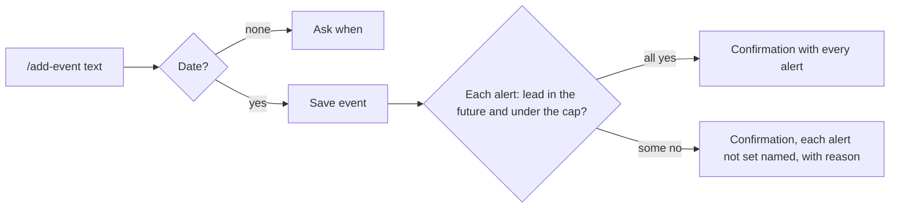

# Design — Events

> **Approved** by @user on 2026-10-02. Locked — changes require a change record (§7).

Context: [PRD](./01-prd.md)
Canvas: https://claude.ai/artifact/7wmZy76NJhCnhnkaEswbCA
Exports: `./assets/canvas/`, one `.dc.html` per artboard, `canvas.json` for the
layout. Generated from 003's and 005's artboards, so every token, the rail, the
capture dock, the notification toast and the records table are theirs unchanged.

Over the 200-line budget at about 230: four surfaces, each with its own state table.

Four direction questions answered before drafting, all recommended, on
2026-10-02: desktop light and dark only, `/events` grouped by month, past events
dimmed below upcoming in Records, the alert as a field row with a lead picker.
Since 2026-10-03 an event carries any number of alerts (PRD change, X-1): the
field row became a list of rows, each with its own lead picker.

## 1. Design intent

An event is a date first, so every list leads with the date: a small date box in
`/events`, the When column in Records. Everything the capture line resolved is
echoed back in words on the confirmation card, with a dim note under any field
Slashit inferred, so a wrong guess is caught before the user leaves. The alert
is a property of the event, never a second record: alerts show as one field
listing each lead and when it fires, a blue bell beside the title, and a toast
per alert that opens the event.

## 2. Screen inventory

| Screen | Purpose | Serves | Canvas artboard |
|---|---|---|---|
| Captured | Yearly birthday with an alert; timed event with end, location and alert | FR-1, FR-3, FR-8, FR-9, FR-14, FR-15 | `Main` |
| Date rules | Passed date moves to next year; end after midnight | FR-4, FR-7 | `EventResolved` |
| More date rules | Past year saved as past; Feb 29 yearly; multi-day | FR-5, FR-6, FR-10 | `EventResolvedMore` |
| Questions and cap | No date asks when; 501st event refused | FR-2, FR-31 | `EventAsk` |
| Several alerts | Two leads, both set; a lead named twice, kept once | FR-14, FR-34 | `EventAlerts` |
| Alert not set | The event's one alert: lead already passed; reminder cap reached. Event saved either way | FR-19, FR-33 | `EventAlertNotSet` |
| Some alerts not set | One of two leads passed, the other set; at the reminder cap, the alerts that fire first are set and the rest named | FR-19, FR-33 | `EventAlertsPassed`, `EventAlertsCap` |
| Capture states | Saving, model unavailable, offline, signed out | FR-1 | `EventCaptureStates` |
| `/events` | Upcoming events by month, soonest first, ongoing multi-day included | FR-24, FR-25 | `EventsList` |
| `/events` states | Loading, empty, error, offline | FR-24 | `EventsListStates` |
| Discovery | `/add` lists `/add-event`; `/events` found by name | FR-1 | `EventDiscovery` |
| Alert toast | Alert fires as a reminder notification, opens the event | FR-17, FR-18, FR-20 | `EventAlertToast` |
| Records, Events | Upcoming first, past below, dimmed with a Past pill | FR-25, FR-26 | `RecordsEvents` |
| Records, All | Events among other types, diamond marker | FR-26 | `RecordsAllEvents` |
| Records states | Loading, empty, error, offline, signed out | FR-26 | `RecordsEventsStates` |
| Detail, yearly | Every field, next occurrence, one alert and when it fires | FR-11, FR-12, FR-27, FR-32 | `EventDetail` |
| Detail, timed | End, location, description, timezone, two alerts | FR-13, FR-27 | `EventDetailTimed` |
| Detail, past | Past marker and where it is still listed | FR-25 | `EventDetailPast` |
| Detail states | Loading, not found or deleted, error, signed out | FR-23, FR-27 | `EventDetailStates` |
| Edit | Every field, all-day toggle, Every year, a list of alerts each with a lead picker and Remove, Add alert | FR-21, FR-22, FR-28 | `EventEdit` |
| Edit invalid | No title; end date before start | FR-28 | `EventEditInvalid` |
| Edit, alert passed | One alert's lead already passed, marked on its row; Save disabled | FR-19 | `EventEditAlertPast` |
| Edit saving, failed | Spinner; failure keeps edits and states the alerts are unchanged | FR-28 | `EventEditSaving`, `EventEditFailed` |
| Delete | Confirms; says the series and alerts go too | FR-11, FR-23, FR-29 | `DeleteEvent`, `DeleteEventFailed` |

`Main` is the capture artboard because the canvas format requires an entry file
of that name, and one-line capture is the feature's defining moment.

### Dark theme

`DarkMain`, `DarkEventsList`, `DarkRecordsEvents`, `DarkEventDetail`,
`DarkEventAlertToast` apply 005's dark token block exactly, plus the dark values
in §6.

## 3. Flows

| Flow | Entry | Steps | Exit | Serves |
|---|---|---|---|---|
| Capture | `/add-event <text>` | Saving card, confirmation card with every resolved field | Event saved, or one question | FR-1 to FR-10, FR-14, FR-15, FR-34 |
| Answer a question | One-question card | Pick a chip or type a reply | Confirmation card | FR-2 |
| Look ahead | `/events` | Month-grouped card | Open in Records, or an event | FR-24 |
| Alert | Alert fires | Toast and notification list entry | Done, Snooze, or Open event | FR-17, FR-18 |
| Change | Detail, Edit | Form, Save | Detail with every alert moved | FR-21, FR-22, FR-28 |
| Delete | Detail, Delete | Confirm dialog | Records, Events tab | FR-23, FR-29 |

## 4. States

### Capture card (`Main`, `EventResolved`, `EventAsk`, `EventAlerts`, `EventAlertNotSet`, `EventAlertsPassed`, `EventAlertsCap`, `EventCaptureStates`)

| State | What the user sees | Copy |
|---|---|---|
| Empty | N/A. Capture always has an argument or asks | — |
| Loading | 001's saving pill with skeleton fields | "Saving event" |
| Error | Model unavailable: 001's not-saved card, command kept | "Slashit can't read that right now" |
| Success | Green pill, fields in a three-column grid, dim inference notes | "Event saved" |
| No permission | Blue note with Sign in, text kept | "Your session ended" |
| Needs an answer | 001's one-question card with chips | See §8 |
| Alert not set | Event saved, amber note inside the card. With several alerts, the field lists each, dimmed "Not set" on those not set | See §8 |
| Limit reached | 001's red refusal, text kept | See §8 |
| Offline | Amber note before anything is sent | "You are offline. Nothing was sent." |

### `/events` card (`EventsList`, `EventsListStates`)

| State | What the user sees | Copy |
|---|---|---|
| Empty | Calendar icon and an example command | "No upcoming events" |
| Loading | Skeleton date boxes and lines | — |
| Error | Red note with Try again | "Couldn't load your events" |
| Success | Month headings with counts; rows with date box, title, place, alert, when, pills | "{n} upcoming events · soonest first" |
| No permission | N/A. Capture is reachable only signed in, per 002 | — |
| Offline | Amber note | "You are offline." |

### Records, Events tab (`RecordsEvents`, `RecordsEventsStates`)

| State | What the user sees | Copy |
|---|---|---|
| Empty | Centred note, Go to Capture | "No events yet" |
| Loading | 003's skeleton rows under an Upcoming heading | — |
| Error | Red note with Try again | "Couldn't load your events" |
| Success | Upcoming group, then Past group dimmed | "{n} events" |
| No permission | Sign in card | "Your session ended" |
| Offline | Amber note; loaded rows stay readable | "You are offline." |

### Detail, edit and delete (`EventDetail*`, `EventEdit*`, `DeleteEvent*`)

| State | What the user sees | Copy |
|---|---|---|
| Empty | Unset fields read "None" in dim text | — |
| Loading | Skeleton fields | — |
| Error | Load: red note, Try again. Save: red note above the form, edits kept. Delete: red note in the dialog | See §8 |
| Success | Fields and footer with the original command | — |
| No permission | Sign in card | "Your session ended" |
| Not found | 003's not-found card | "This event doesn't exist or was deleted" |
| Invalid | Red field border and message, Save disabled. A passed alert is marked on its own row | See §8 |
| Saving | Spinner in Save, fields dimmed | — |

## 5. Responsive behaviour

| Breakpoint | Layout change |
|---|---|
| Mobile | Not drawn. Deferred app-wide with 003's D-31 |
| Tablet | No distinct layout. The 760px capture column and the records table flex as in 001 |
| Desktop | As drawn at 1440x900 |

## 6. Design system deltas

| Change | Kind | Token or component | Why existing one does not fit |
|---|---|---|---|
| Event marker (`.dot.evt`) | added | component | A green diamond. Square is task, round is reminder and memory |
| Past pill (`.pill.past`) | added | component | Neutral. Done is green and means finished, which a past event is not |
| Alert pill (`.pill.alert`) | added | component | Blue, `--blue` on `--blueWash`, the approved pill pair |
| Month heading (`.monthhead`) | added | component | 003's `.grouphead` sits inside a table; `/events` is a card of rows |
| Event row and date box (`.evrow`, `.datebox`, `.evmeta`) | added | component | No list leads with a date today |
| All-day toggle (`.toggle`) | added | component | No boolean control exists in 001's form set |
| Alert row (`.alertlist`, `.alertrow`, `.iconbtn`) | added 2026-10-03 | component | Lead picker, fire time and a Remove button per alert. No repeating form row exists in 001's form set |
| Dark values | added | token | `.monthhead` and `.grouphead` `#201d1a`, `.evrow` divider `#2b2724`, `.pill.past` `#2b2724` |
| Everything else | reused | tokens, components | 003 and 005 stylesheets, unchanged |

`.statebox` and `.statecap` frame several states on one artboard. They are canvas
annotation, not product.

## 7. Accessibility

| Area | Decision |
|---|---|
| Contrast | Past rows use `--ink3` on `--surface`, as 003's done rows. Pills use approved pairs |
| Keyboard path | Rows in `/events` and Records are one tab stop each; Enter opens detail. In edit, each alert's lead picker is a listbox: arrows move, Enter picks. Tab goes picker, Remove, next alert, then Add alert. After Add alert, focus moves to the new row's picker; after Remove, to the next row's picker, or Add alert |
| Screen reader labels | Date box is read as the full date, "Monday 12 October". The bell beside a title reads "alert set, 1 day before", or "2 alerts set, 1 day and 1 hour before". Each Remove reads "Remove alert, 1 hour before". The diamond reads "Event" |
| Motion and reduced motion | Only 001's skeleton shimmer and spinner, already reduced-motion aware |
| Focus order | After capture, focus stays in the input. After delete, focus moves to the Events tab |

## 8. Copy

| Location | Text | Notes |
|---|---|---|
| Palette | "/add-event · Create an event" · "/events · List your upcoming events" | Source §8.2 |
| Inferred all-day | "No time given, so all day" | FR-3 |
| Inferred yearly | "Read from “birthday”" | FR-9, so a wrong guess is visible |
| Passed date | "1 Oct has passed this year, so next year" | FR-4 |
| Overnight | "Ends after midnight, so on Sun 4 Oct" | FR-7 |
| Feb 29 | "Feb 29 in leap years, Feb 28 otherwise" | FR-10 |
| Ask when | "When is the dentist appointment?" · "Reply with a date, and a time if there is one. Nothing is saved until you answer." | FR-2 |
| Lead named twice | "“1 day before” was named twice, kept once" | FR-34 |
| Alert passed | "The alert was not set" · "2 days before is Thu 1 Oct, which has already passed. Edit the event to choose a later alert." | FR-19 |
| Reminder cap | "You have 100 active reminders and alerts, the most Slashit holds. Mark a reminder done or remove an alert, then add it here." | FR-33 |
| Some alerts not set | "1 of 2 alerts was not set" · "2 days before is Thu 1 Oct, which has already passed. The other alert is set." | FR-19 |
| Some alerts over the cap | "1 of 3 alerts was not set" · "You have 100 active reminders and alerts, the most Slashit holds. The alerts that fire first were set. Free one up, then add 3 hours before in Edit." | FR-33 |
| Edit, alert passed | "1 week before is Fri 2 Oct, 4:00 PM, which has passed. Pick a shorter alert or remove this one." | FR-19 |
| Edit, picker | A lead already on the event reads "added" | FR-34 |
| Event cap | "You have 500 upcoming events, the most Slashit holds." · "Delete one you no longer need, then try again. What you typed is kept below. Past events do not count." | FR-31 |
| Toast head | "Event alert · {lead}" | FR-18 |
| Detail note | "Editing changes every year's occurrence. Alerts move with the event and are shown only here, not under Reminders." | FR-11, FR-21, FR-32 |
| Past note | "This event has passed. It is no longer listed by /events, and stays here in Records." | FR-25 |
| Delete, yearly | "“Mom's birthday” repeats every year. Deleting it removes every year's occurrence and its alerts, which will not fire again." | FR-11, FR-23 |
| Save failed | "Your changes were not saved" · "Nothing changed, and the alerts still fire at their old times." | |

A timed or multi-day event between its start and end shows "Happening now",
per Q3. It stays in `/events` until its end, as FR-25 already states.

## 9. Open questions

| # | Question | Options | Owner | Answer |
|---|---|---|---|---|
| ~~Q1~~ | What do the buttons on an event alert do? | **(Recommended)** Done, Snooze, Open event, as 003; Done closes the alert for this occurrence and leaves the event untouched · Open event and Dismiss only | user | **Answered 2026-10-02.** Done, Snooze, Open event, as drawn |
| ~~Q2~~ | Does the lead picker offer Custom? | **(Recommended)** Yes: presets plus Custom, a number and minutes, hours, days or weeks · Presets only | user | **Answered 2026-10-02.** Presets plus Custom, as drawn |
| ~~Q3~~ | Keep "Happening now" between start and end? | **(Recommended)** Yes, it fills the gap in FR-24 and FR-25 · No, an event is Upcoming until it ends | user | **Answered 2026-10-02.** Yes, as drawn |

## Change log

| Date | Change | Why | Approved by |
|---|---|---|---|
| 2026-10-02 | Created. 29 artboards across Capture, Records and Dark theme pages, generated from 003's and 005's artboards. Four direction questions answered first, all recommended. Canvas published | PRD approved, user asked to start design | user |
| 2026-10-02 | Q1 to Q3 answered, all as drawn | User chose the recommended options | user |
| 2026-10-02 | Approved | User: "designs fine, move with next" | user |
| 2026-10-03 | Any number of alerts per event, following the PRD change (X-1). FR-16's "which alert?" question removed from `EventAsk`, the flow and §8. Added artboards `EventAlerts` (FR-14, FR-34), `EventAlertsPassed` (FR-19), `EventAlertsCap` (FR-33). Redrawn: `EventDetailTimed` with two alerts; `EventEdit`, `EventEditInvalid`, `EventEditAlertPast`, `EventEditSaving`, `EventEditFailed` with an alert list and Repeat moved beside Starts and Ends. Copy changed on the detail note, delete and save-failed in `EventDetail`, `DeleteEvent`, `DeleteEventFailed`, `DarkEventDetail`. Delta: alert row component. Canvas republished, 32 artboards. Stale: build plan, implementation plan index, 4.1 | PRD change approved 2026-10-03. Change approved 2026-10-03 | user |
