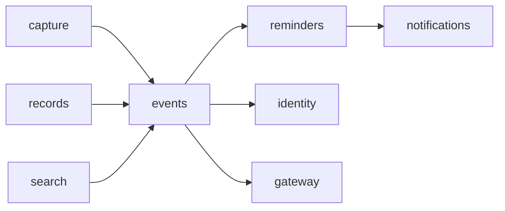

# Build Plan (HLD) — Events

> **Approved** by @user on 2026-10-02. Locked — changes require a change record (§7).

Context: [PRD](./01-prd.md) · [Design](./02-design.md) ·
[Tech stack](../tech-stack.md) · [003 build plan](../003-reminders-and-notifications/03-build-plan.md) ·
[005 build plan](../005-personal-search-and-context/03-build-plan.md)

Tables touched:

- `calendar_events`: new. Changed 2026-10-03: `alert_lead_minutes` becomes the list `alert_leads_minutes`
- `reminders`: changed, gains a nullable `event_id`, many rows per event
- `notifications`: changed, `notification_kind` gains `event_alert`
- `capture_turns`, `pending_captures`: changed, new outcome and missing-field values

## 1. Architecture summary

A new `events` domain owns the event record, its schedule and its alerts. It is
a record type in the shape tech stack §3 fixes: its own domain (003 AD-1), its
own `SearchPort` with search columns on its own table (005 AD-1, AD-2), reached
by `records`, `capture` and `search` through ports.

An alert is not new machinery. Each alert is a one-time reminder row with
`event_id` set, so 003's firing, delivery, channel switches, exactly-once
constraints and the 100-reminder cap all apply unchanged (FR-17, FR-33). An
event has any number of these rows, one per lead (FR-14). Reminders hides rows
with an `event_id` from its own lists and search (FR-32). Events re-arms every
alert for the next occurrence of a yearly event (FR-20).

An event stores its schedule in local terms plus `schedule_timezone`, as 003
AD-5 does, and keeps two derived UTC instants, `starts_at` and `ends_at`, for
the next or only occurrence. Every list, the cap and the past rule read those
two columns.

## 2. Component map



| Component | Change | Responsibility |
|---|---|---|
| `events` domain | new | Table, schedule function, service, GraphQL types and mutations, jobs, `public.py` |
| `events/services/schedule.py` | new | One pure function: local fields, timezone, now in; `starts_at`, `ends_at`, status out. Covers FR-3 to FR-7, FR-10, FR-12, FR-13 |
| `reminders` | changed | `set_event_alerts`, `clear_event_alerts` on its public service; lists and search skip `event_id` rows; firing writes kind `event_alert` with `target_id` the event |
| `notifications` | changed | New kind; the toast's Open goes to the event |
| `capture` | changed | `/add-event`, `/events`; one extraction schema; one new question (FR-2) |
| `records` | changed | Events tab, events under All, through an `EventRecordsPort` |
| `search` | changed | `EventsSearchAdapter`, registered so 005 AD-11's test passes |
| `identity` | unchanged | Its `timezone_changed` job is also deferred to events, by name |
| Frontend | changed | Event store, `/events` card, Records tab, detail, edit, delete, toast copy, per [the design](./02-design.md) |

Events depends on reminders, never the reverse. Reminders learns an event id and
a title to show, nothing else.

## 3. Data model

```sql
CREATE TABLE calendar_events (
  id uuid PRIMARY KEY,
  user_id uuid NOT NULL REFERENCES auth.users(id),
  title text NOT NULL,                   -- 1..200 chars
  location text,                         -- 0..200
  description text,                      -- 0..2000
  start_date date NOT NULL,              -- local
  start_time time,                       -- NULL: all-day (FR-3)
  end_date date,                         -- multi-day or overnight (FR-6, FR-7)
  end_time time,
  repeat_yearly boolean NOT NULL DEFAULT false,
  schedule_timezone text NOT NULL,
  starts_at timestamptz NOT NULL,        -- next or only occurrence, derived
  ends_at timestamptz NOT NULL,          -- derived; all-day ends at local midnight after
  alert_leads_minutes integer[] NOT NULL DEFAULT '{}',  -- distinct, ascending; empty: no alert (FR-14, FR-34)
  origin record_origin NOT NULL,
  original_input text,
  created_at, updated_at timestamptz NOT NULL,
  deleted_at timestamptz,
  embedding vector(768),
  search_vector tsvector GENERATED ALWAYS AS (
    to_tsvector('english', title || ' ' || coalesce(location,'') || ' ' || coalesce(description,''))) STORED
);
CREATE INDEX ON calendar_events (user_id, starts_at) WHERE deleted_at IS NULL;
CREATE INDEX ON calendar_events USING gin (search_vector);
-- RLS enabled and forced, policy user_id = auth.uid(), grants to authenticated (T2, AD-7 of 000)

ALTER TABLE reminders ADD COLUMN event_id uuid REFERENCES calendar_events(id);
CREATE INDEX ON reminders (event_id) WHERE event_id IS NOT NULL AND deleted_at IS NULL;
ALTER TYPE notification_kind ADD VALUE 'event_alert';
ALTER TYPE capture_turn_outcome ADD VALUE 'event_created';  -- and 'events_listed'
```

| Rule | Where it is enforced |
|---|---|
| Past: `ends_at < now()` and not yearly (FR-25) | Query and `schedule.py` |
| Happening now: `starts_at <= now() < ends_at` (design Q3) | `schedule.py` |
| Yearly roll: when `ends_at` passes, recompute to next year and re-arm every alert | `events.roll_yearly`, periodic |
| Leads are distinct and ascending; a lead named twice is stored once (FR-34). Each lead is 0 to 525600 minutes | Service before write; a CHECK on each element |
| The event's leads are the truth. Any change to the leads or the schedule replaces the event's open alert rows as one set, in one transaction (FR-21, FR-22) | `reminders.set_event_alerts` |
| Under the 100-reminder cap, fire times are set soonest first; the rest are returned as not set, reason `cap`. A fire time already past is returned as not set, reason `passed` (FR-19, FR-33) | `reminders.set_event_alerts`, counting the cap without the event's own rows being replaced |
| Cap: 500 rows not deleted and not past (FR-31) | Service, in the create transaction |
| A timed event with no end ends at local midnight, so it stays listed that day (FR-25) | `schedule.py` |
| Soft delete; deleting an event soft-deletes all its alerts in the same transaction (FR-23, FR-29) | Service |

## 4. API surface

```graphql
type Event { id: ID! title: String! location: String description: String
  startDate: Date! startTime: Time endDate: Date endTime: Time allDay: Boolean!
  repeatYearly: Boolean! startsAt: DateTime! endsAt: DateTime!
  status: EventStatus!   # UPCOMING | HAPPENING_NOW | PAST
  alerts: [EventAlert!]!   # set alerts, soonest first
  origin: RecordOrigin! originalInput: String createdAt: DateTime! }
type EventAlert { leadMinutes: Int! firesAt: DateTime! }
type AlertNotSet { leadMinutes: Int! reason: AlertNotSetReason! }   # PASSED | CAP

extend type Query { event(id: ID!): Event  events(include: EventScope = UPCOMING): [Event!]! }
extend type Mutation {
  updateEvent(id: ID!, input: EventInput!): UpdateEventResult!   # EventUpdated | EventInvalid | NotFound
  # EventInput.alertLeadsMinutes: [Int!]!; EventUpdated { event, alertsNotSet: [AlertNotSet!]! }
  deleteEvent(id: ID!): DeleteEventResult!
}
```

Creation goes through capture's existing `submitCapture`, whose result union
gains `EventCreated` (with `alertsNotSet: [AlertNotSet!]!`) and `EventsListed`.
`RecordUnion` and search's union gain `Event` (005 AD-8). Event lists are loaded
per user in one query; no per-row resolver, so no DataLoader is needed (T5).

## 5. Model and vendor choices

| Call | Model | Budget | Cost per call | Fallback |
|---|---|---|---|---|
| `/add-event` extraction | `gemini-3.6-flash`, effort low, through the gateway (T4) | about 700 in, 150 out tokens, `estimate` | about 0.0001 USD, tech stack §5's rate | 001 FR-35's not-saved card; nothing half-saved |
| Embedding title, location, description | `gemini-embedding-001`, 768, by `events.embed_event` after commit | one call per create or text edit | negligible, uncounted (T9) | NULL embedding; 004's backfill retries |

The extraction returns title, start date, optional start time, end date and
time, location, description, a yearly flag, and zero or more alert leads in
minutes, against the user's local now and timezone (003 AD-7). Rules the model
should not judge are code: next occurrence (FR-4), overnight end (FR-7),
Feb 29 (FR-10), lead in the past (FR-19), a lead named twice (FR-34), which
alerts fit under the cap (FR-33).
`/events` makes no model call.

## 6. Cross-cutting concerns

| Concern | Rule |
|---|---|
| Auth | Every resolver requires a session (002). Background jobs use the service role and pass `user_id` explicitly (T3) |
| Tenancy and isolation | `calendar_events` has RLS, policy `user_id = auth.uid()`, forced, with grants (T2). The alert reminder carries the same `user_id`; the service checks the event's owner before touching it. Tests: user A reads, edits, deletes and searches user B's event and gets nothing (T7, NFR-6) |
| Limits | 500 upcoming events (FR-31). No cap on alerts per event; every alert counts in 003's 100 (FR-33). Text lengths as §3 |
| Cost | One generation per `/add-event`, one embedding per create or text edit. Inside tech stack §5's envelope |
| Observability | Events created, by field present; alerts per event; edits within five minutes; alert-not-set per alert, by reason (PRD §8). NFR-4: a nightly `events.reconcile_alerts` counts alerts whose fire time disagrees with their event or whose event is deleted, and logs the count. No event text in any of it (T6, 005 AD-10) |
| Timezone | Identity's `timezone_changed` is deferred to `events.timezone_changed` by name. All-day and yearly keep local fields; one-time timed keeps its instant (FR-12, FR-13). Each affected alert is re-set |

## 7. Alternatives considered

| Option | What it gives | Why it lost |
|---|---|---|
| Alerts as a second scheduler inside events | No change to reminders | Duplicates 003's firing, exactly-once and delivery, the riskiest code in the product |
| Alert as a yearly reminder row | No re-arm job | Wrong by a day for Feb 29 events in common years, and a yearly reminder drifts from its event after an edit |
| Alerts as a separate `event_alerts` table read by reminders | Clean ownership | Reminders would read another domain's table, breaking repo rules §6 |
| Leads in a child table `calendar_event_alerts` owned by events, one row per lead, each pointing at its reminder row | Each alert has its own id, so an edit can change one without touching the others | A second new table and a join on every read, for edits that §3 already makes cheap by replacing the set. Q5 |
| One reminders row per event holding every lead | One row to keep in step | Reminders' firing, snooze and exactly-once all assume one fire time per row |
| Compute next occurrence on every read, no stored instants | No roll job | Lists, the cap and 010's Today view all need an index on time |
| Table named `events` | Matches the record name | Taken by analytics' `events` table (migration 0035) |

## 8. Architecture decisions

| # | Decision | Status | Graduates |
|---|---|---|---|
| AD-1 | New `events` domain; table `calendar_events` | locked | no |
| AD-2 | Schedule in local terms plus timezone, with derived `starts_at` and `ends_at` from one pure function | locked | no |
| AD-3 | Each alert is a one-time `reminders` row with `event_id`, any number per event; reminders hides those rows from its lists and search | locked; changed 2026-10-03 | yes, tech stack §3, as the pattern for any record type's alerts |
| AD-4 | `events.roll_yearly`, periodic every 15 minutes, moves past yearly events to next year and re-arms all their alerts | locked | no |
| AD-5 | Alert notifications use kind `event_alert` with `target_id` the event; Done and Snooze act on the alert, as 003 | locked | no |
| AD-6 | Capture rules that are arithmetic are code, not model judgement (§5) | locked | no |
| AD-7 | `EventsSearchAdapter` registered; events embedded by `events.embed_event` after commit | locked | no |
| AD-8 | The event stores its leads as a distinct, ascending `integer[]`. `reminders.set_event_alerts(event_id, fire_times)` replaces the event's open alert rows as one set, soonest first under the cap | locked 2026-10-03 | yes, tech stack §3, with AD-3 |

## 9. Questions for the user

| # | Question | Options | Answer |
|---|---|---|---|
| ~~Q1~~ | Table name, since `events` is analytics' | **(Recommended)** `calendar_events` · Rename analytics' table to `analytics_events`, a migration on live data | **Answered 2026-10-02.** `calendar_events` |
| ~~Q2~~ | How does a yearly event's alert reach next year? | **(Recommended)** Re-armed by a periodic roll job, AD-4 · A yearly reminder row, wrong by a day around Feb 29 | **Answered 2026-10-02.** Roll job re-arms |
| ~~Q3~~ | Roll job frequency | **(Recommended)** Every 15 minutes: an alert at most 15 minutes late to re-arm, cheap · Hourly · Every minute, with the firing sweep | **Answered 2026-10-02.** Every 15 minutes |
| ~~Q4~~ | Split into slices at stage 4? | **(Recommended)** Two: capture, list and Records; then alerts, edit, delete, search · One plan | **Answered 2026-10-02.** Two slices |
| ~~Q5~~ | Where do an event's alert leads live? | **(Recommended)** An `integer[]` on `calendar_events`; an edit replaces the event's alert rows as a set, AD-8. No new table · A child table `calendar_event_alerts`, one row per lead, so an edit can touch one alert and keep another's snooze. One more table and a join | **Answered 2026-10-03.** `integer[]` on the event, AD-8 |

## 10. Risks

| Risk | Likelihood | Impact | Mitigation |
|---|---|---|---|
| Alert and event disagree after an edit, a delete or a timezone change | med | med | Set in one transaction; `reconcile_alerts` nightly; NFR-4 test cases |
| Replacing the set on a schedule edit drops a snooze the user set on one alert | low | low | The moved alert fires at its new time anyway (FR-21). A title or text edit does not touch alerts |
| One event's alerts use most of the 100-reminder cap | low | med | FR-33's not-set list names each; alerts-per-event metric |
| Reminders' lists leak alert rows | med | med | One repository filter, with a test on each list and search |
| All-day event shifts across a timezone change | med | high | Local fields are the truth; tests across the date line (NFR-3) |
| Extraction misreads ranges and leads | med | med | AD-6 moves arithmetic to code; labelled set for NFR-2 before build |
| A new enum value on a live table | low | low | `ALTER TYPE ... ADD VALUE` is non-blocking on PostgreSQL 12+ |

## Change log

| Date | Change | Why | Approved by |
|---|---|---|---|
| 2026-10-02 | Created | Design approved | user |
| 2026-10-02 | Q1 to Q4 answered, all as recommended | User chose the recommended options | user |
| 2026-10-02 | Approved. AD-1 to AD-7 locked; AD-3 graduated to tech stack §3 | User: "Proceed" | user |
| 2026-10-03 | Any number of alerts per event (X-1, PRD and design changes). `alert_lead_minutes` becomes `alert_leads_minutes integer[]`; the unique index on `reminders(event_id)` becomes a plain index. `set_event_alert` becomes `set_event_alerts`, replacing the set, soonest first under the cap. API: `Event.alerts`, `AlertNotSet` per alert, `EventUpdated`. FR-16's question removed from capture. AD-3 and AD-4 reworded, AD-8 added and locked, Q5 answered as recommended, two alternatives and two risks added. Tech stack §3 updated with it. Slice 1 ships `alert_lead_minutes` on `main`, so slice 2's migration converts it. Stale: implementation plan index, 4.1 | Design change approved 2026-10-03. Change approved 2026-10-03 | user |
